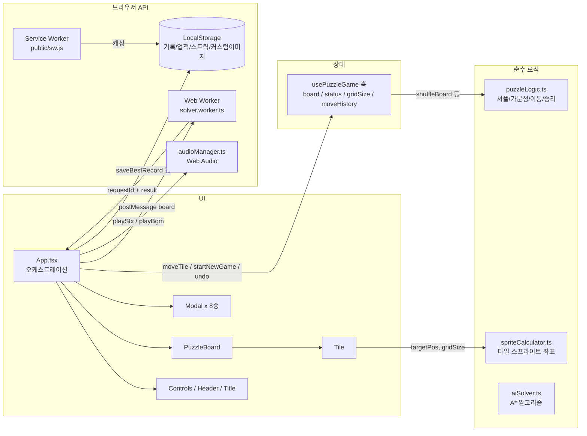

# 📖 PROJECT GUIDE — 통합 운영 문서 (Single Source of Truth)

> **대상**: 새로 시작하는 모든 세션 (Frontend DEV, QA 등)
> **목적**: 프로젝트 구조·업무 배분·진행 상황·작업 규칙을 본 문서 하나로 파악한다.
> **운영 원칙**: `README.md`(대외용 소개)를 제외한 모든 운영 정보는 본 문서에만 기록한다. `docs/` 폴더는 **이력 자료일 뿐 수정 대상이 아니다.**
> **갱신 규칙**: 모든 세션은 종료 시 본 문서의 `5. 업무 파트 배분표`에 직접 `[x]` 체크하고 `7. 진행 상태 대시보드`를 갱신한다.

* **최종 갱신일**: 2026-08-17
* **문서 버전**: v2.7 (QA03: 사용자 피드백 대응 3건 + 서브패스 배포 회귀 검증 완료)

---

## 1. 프로젝트 스냅샷 (Project Snapshot)

| 항목 | 내용 |
| :--- | :--- |
| **프로젝트명** | Sliding Block Puzzle (N-Puzzle 웹 게임) |
| **형태** | 100% 서버리스 클라이언트 사이드 웹 앱 (백엔드 없음) |
| **기술 스택** | React 19, TypeScript 5.7, Vite 6, Vanilla CSS |
| **핵심 Web API** | Canvas, Web Audio, Web Worker, Service Worker, Web Vibration, Web Share |
| **현재 버전** | v1.2.0 (Phase 1~5 완료, v1.1 정비 완료, v1.2 피드백 대응 및 QA 검증 완료) |
| **테스트** | Vitest 14개 파일 / **79개 케이스 전부 PASS** |
| **타입 검사** | `npx tsc --noEmit` — 0 Errors |
| **git 상태** | `main` 브랜치, v1.2 사용자 피드백 대응 전 파트(DEV03~06, QA03) 완료 (v2.7) |
| **현재 오픈 업무** | 없음 (전 파트 완료, 운영 대기) |

### 실행 명령
```bash
npm run dev      # 개발 서버 (http://localhost:5173)
npm run build    # tsc + vite 프로덕션 빌드
npm test         # Vitest 전체 테스트 (71개)
npx tsc --noEmit # 타입 검사
```

---

## 2. 아키텍처 한 눈 (Architecture Overview)

### 2.1 디렉토리 구조

```
sliding-block-puzzle/
├── PROJECT_GUIDE.md            # 📌 본 문서 (유일한 운영 문서 / 모든 세션의 진입점)
├── README.md                   # 대외용 소개 (개발 상세는 본 문서 참조)
├── public/                     # 정적 에셋: 아이콘, 오디오, 테마 이미지, 스프라이트, sw.js, manifest
├── src/
│   ├── components/             # UI 컴포넌트 (영역별 폴더 + 동일 이름 CSS)
│   │   ├── Board/              #   PuzzleBoard, Tile (퍼즐 보드 렌더링)
│   │   ├── Controls/           #   조작 툴바 (난이도/모드/Undo/힌트/셔플 등)
│   │   ├── Header/             #   상단 HUD (타이머, 이동수, 기록)
│   │   ├── Title/              #   타이틀 화면
│   │   ├── Modal/              #   Win/Hint/Theme/CustomImage/Daily/Achievement/GameOver/Bgm 모달
│   │   ├── Achievement/        #   업적 토스트
│   │   └── PWA/                #   설치 배너
│   ├── hooks/
│   │   ├── usePuzzleGame.ts    #   ⭐ 게임 전체 상태의 중심 (보드/상태/타이머/Undo/챌린지)
│   │   ├── useAudio.ts         #   오디오 훅 (BGM/SFX 컨트롤)
│   │   └── useAssetPreloader.ts#   에셋 사전 로딩 훅
│   ├── utils/                  # 순수 로직 및 브라우저 API 유틸 (대부분 단위 테스트 존재)
│   ├── workers/                # solver.worker.ts (A* 탐색 Web Worker)
│   ├── i18n/                   # translations.ts (KO/EN/JA/ZH), useTranslation.ts
│   ├── types/                  # puzzle.ts, theme.ts, achievement.ts
│   ├── styles/                 # index.css(전역), App.css
│   ├── App.tsx                 # ⭐ 오케스트레이션 (모달/화면 전환/AI 힌트/승리 후처리)
│   └── main.tsx                # 진입점
├── docs/                       # ⚠️ 이력 자료 폴더 (과거 역할별 문서. 참고용, 수정 대상 아님)
└── scripts/                    # 에셋 생성/가공용 Node 스크립트 (유지보수 시 사용)
```

### 2.2 데이터 흐름 (Data Flow)



**핵심 규칙**
- 게임 상태의 단일 소유자는 `usePuzzleGame` 훅. UI 컴포넌트는 상태를 직접 가지지 않고 props/callback으로만 동작.
- 순수 로직(`utils/*`)은 React 비의존. 변경 시 반드시 대응 `*.test.ts` 갱신.
- 비동기 응답(AI 힌트)은 반드시 `requestId` 대조 후 반영 (레이스 컨디션 방지 패턴).

---

## 3. 기능 ↔ 파일 매핑 (Feature-File Map)

수정 작업 전 **반드시 이 표로 연관 파일을 먼저 확인**한다. 파일 하나가 여러 기능에 걸쳐 있으면 연쇄 영향 범위를 미리 파악한다.

| # | 기능 영역 | 담당 파일 | 주요 연관 기능 |
| :---: | :--- | :--- | :--- |
| 1 | **코어 퍼즐 엔진** (셔플/가분성/이동/승리) | `src/utils/puzzleLogic.ts`, `src/types/puzzle.ts`, `src/hooks/usePuzzleGame.ts` | 3, 7, 11 (모든 게임 플로우의 기반) |
| 2 | **보드 렌더링** (스프라이트 분할) | `src/components/Board/PuzzleBoard.tsx`, `Tile.tsx`, `*.css`, `src/utils/spriteCalculator.ts` | 5, 6 (테마·커스텀이미지 렌더링) |
| 3 | **챌린지 모드** (Standard/Time Attack/Move Limit) | `src/hooks/usePuzzleGame.ts` (TIME_LIMITS, MOVE_LIMITS), `src/components/Modal/GameOverModal.tsx`, `src/components/Header/Header.tsx` | 1, 8 |
| 4 | **AI 스마트 힌트** (A* Web Worker) | `src/utils/aiSolver.ts`, `src/workers/solver.worker.ts`, `src/App.tsx` (requestId 검증, 쿨다운) | 1 |
| 5 | **테마 시스템** (4종 프리셋/숫자 모드) | `src/utils/themeData.ts`, `src/types/theme.ts`, `src/components/Modal/ThemeModal.tsx`, `src/components/Board/Tile.tsx` | 2, 6, 16 |
| 6 | **커스텀 이미지 업로드/크롭** | `src/components/Modal/CustomImageModal.tsx`, `src/App.tsx` (customImageSrc) | 2, 5, 16 |
| 7 | **일일 챌린지 & 스트릭** | `src/utils/dailyChallenge.ts`, `src/utils/prng.ts` (Mulberry32), `src/components/Modal/DailyModal.tsx` | 1, 8 |
| 8 | **업적 & 별점** | `src/utils/achievementManager.ts`, `achievementData.ts`, `src/types/achievement.ts`, `src/utils/starCalculator.ts`, `src/components/Modal/AchievementModal.tsx`, `Achievement/AchievementToast.tsx` | 3, 7, 11 |
| 9 | **오디오** (BGM 4트랙/SFX 풀) | `src/utils/audioManager.ts`, `src/hooks/useAudio.ts`, `src/components/Modal/BgmSelectModal.tsx`, `public/assets/audio/` | 전역 사용 |
| 10 | **기록 저장** (난이도별 최고 기록) | `src/utils/recordStorage.ts`, `src/App.tsx` (승리 시 saveBestRecord) | 8 |
| 11 | **Undo / 리플레이** | `src/hooks/usePuzzleGame.ts` (moveHistory, undoMove), `src/components/Controls/Controls.tsx`, `src/components/Modal/WinModal.tsx` | 1, 8 |
| 12 | **PWA / 오프라인 / 설치** | `public/sw.js`, `public/manifest.webmanifest`, `src/components/PWA/PwaInstallBanner.tsx` | 16 (경로 일관성) |
| 13 | **햅틱 진동** | `src/utils/haptics.ts` (이동/승리/에러 피드백) | 1 |
| 14 | **다국어 i18n** | `src/i18n/translations.ts` (KO/EN/JA/ZH), `useTranslation.ts` — 문자열 추가 시 4개 국어 전부 수정 필수 | UI 전역 |
| 15 | **결과 카드 공유** | `src/utils/shareCardGenerator.ts` (Canvas 1000x1000), `src/components/Modal/WinModal.tsx` | 11 |
| 16 | **에셋 로딩/경로** | `src/utils/assetPreloader.ts`, `assetPath.ts`, `src/hooks/useAssetPreloader.ts` | 2, 5, 6, 12 |

### 테스트 파일 목록 (14개 / 79케이스)
`puzzleLogic`, `spriteCalculator`, `starCalculator`, `recordStorage`, `prng`, `audioManager`, `assetPreloader`, `assetPath`, `aiSolver`, `achievementManager`, `usePuzzleGame`, `i18n`, `App`, `BgmSelectModal` — 각각 동일 이름의 `*.test.ts(x)` 존재.

---

## 4. 문서 체계 (Documentation Policy)

| 문서 | 위치 | 용도 | 수정 주체 |
| :--- | :--- | :--- | :--- |
| **PROJECT_GUIDE.md** | 루트 | **유일한 운영 문서.** 업무 배분·상태·규칙의 단일 소스 | PM + 각 세션(체크/대시보드만) |
| README.md | 루트 | 대외용 소개 (상세 내용은 본 문서 참조) | PM |
| docs/ 폴더 | docs/ | ⚠️ **이력 자료.** 과거 역할별 문서(PRD, 마일스톤, QA 리포트 등) 보관용. **신규 문서 발행·수정 금지** — 내용이 오래되어도 정정하지 않으며, 현행 상태는 항상 본 문서가 우선 | 수정 금지 |

> docs/ 폴더에 포함된 과거 문서들의 상태 표기는 본 문서 `7. 진행 상태 대시보드`에서만 관리한다.

---

## 5. 업무 파트 배분표 (Part Allocation Board)

### 5.1 발번 규칙
- PM이 신규 업무(기능 추가·결함 수정) 발생 시 **역할군 + 연번**으로 파트 ID를 발번한다: `DEV01, DEV02, ... / QA01, QA02, ...`
- 번호는 재사용하지 않고 계속 증가시킨다. 완료된 파트는 삭제하지 않고 `[x]`로 남긴다 (이력).
- 하나의 파트는 **한 세션이 하나의 기능 영역**만 담당하도록 분할한다 (세션 과부하 방지).
- 의존 관계가 있으면 "의존" 열에 표기한다. 의존 파트가 `[x]`가 되기 전에는 시작할 수 없다.

### 5.2 세션 작업 원칙
- 세션은 **배분받은 파트의 파일만 수정**한다. 그 외 파일 수정 금지.
- 세션 종료 시 **자신의 파트에 직접 `[x]` 체크 + 완료일 기입** (타 파트 체크 금지 → 업무 중복 방지).
- 파트 수행 중 추가 결함 발견 시: 코드 수정하지 말고 PM에게 보고 → PM이 새 파트 ID로 발번.

### 5.3 현재 배분표 (2026-08-17 기준)

| 파트 ID | 역할 | 업무 내용 | 대상 파일 | 의존 | DoD | 상태 |
| :--- | :---: | :--- | :--- | :---: | :--- | :---: |
| **DEV01** | DEV | CSS 하드코딩 절대 경로 5건 검증 (BUG-06 잔여) — Vite 파이프라인상 정상 판정, 수정 불필요 | `src/styles/index.css` L133·162·178, `src/components/Board/Tile.css` L36, `src/components/Modal/WinModal.css` L119 | 없음 | npm test 71 PASS / tsc 0 에러 / build 정상 / 대시보드 갱신 | [x] 완료 2026-08-17 |
| **DEV02** | DEV | 자동 클리어 버튼을 `import.meta.env.PROD`에서 비활성화 (완료 보고서 약속 이행) | `src/components/Controls/Controls.tsx` | 없음 | 동일 | [x] 2026-08-17 |
| **QA01** | QA | BUG-00~10 11건 결함의 코드 반영 여부 회귀 검증 (DEV01·02 산출물 포함) | 전체 소스 대조 + 동적 테스트 | DEV01·DEV02 완료 후 | 검증 결과를 본 문서 대시보드에 반영 | [x] 완료 2026-08-17 |
| **QA02** | QA | 실기기 검수: 모바일(360px) 3x3/4x4/5x5 렌더링, PWA 오프라인 캐싱, SW 404 부재 확인 | 브라우저 실기기 테스트 | 없음 (병렬 가능) | 검증 결과를 본 문서 대시보드에 반영 | [x] 완료 2026-08-17 |
| **DEV03** | DEV | AI 힌트 4x4/5x5 "같은 자리 맴돔" 현상 수정 (그리디 룩어헤드 → A*/IDA* 기반으로 개선) | `src/utils/aiSolver.ts` + `aiSolver.test.ts` | 없음 | 상세: 5.6절 | [x] 완료 2026-08-17 |
| **DEV04** | DEV | 타일 슬라이드 애니메이션 단일화 (상/하/좌/우 속도 통일) | `src/components/Board/Tile.css`, `Tile.tsx`, `PuzzleBoard.css` | 없음 | 상세: 5.6절 | [x] 완료 2026-08-17 |
| **DEV05** | DEV | 타이틀 모드 카드 4종 배경 패턴 통일 (일반모드에 파란색 그라디언트 추가) | `src/components/Title/TitleScreen.css` | 없음 | 상세: 5.6절 | [x] 완료 2026-08-17 |
| **DEV06** | DEV | `vite.config.ts` `base` 설정 (서브패스 배포 대응 — DEV01 결과 후속) | `vite.config.ts` | 없음 | 상세: 5.6절 | [x] 완료 2026-08-17 |
| **QA03** | QA | 사용자 피드백 3건(힌트/애니메이션/카드) 회귀 검증 + DEV06 서브패스 배포 확인 | 해당 기능 전수 | DEV03·04·05·06 완료 후 | 상세: 5.6절 | [x] 완료 2026-08-17 |

### 5.4 완료 이력 (파트 종료 시 이곳으로 이동)

| 파트 ID | 역할 | 업무 | 완료일 | 완료 세션 |
| :--- | :---: | :--- | :---: | :--- |
| DEV01 | DEV | CSS 절대경로 5건 검증 완료 (Vite 파이프라인상 정상 판정) + `vite.config.ts` base 신규 파트 요청 | 2026-08-17 | DEV01 세션 |
| QA01 | QA | BUG-00~10 11건 회귀 검증 완료 — 소스 대조 + 동적 테스트 전건 PASS, 신규 결함 없음 | 2026-08-17 | QA01 세션 |
| QA02 | QA | 실기기 검수 완료 — 사용자 실기기 직접 확인: 360px 3x3/4x4/5x5 렌더링, PWA 오프라인 캐싱, SW 404 부재 이상 없음 | 2026-08-17 | QA02 세션 |
| DEV03 | DEV | AI 힌트 솔버 전면 개편 — 4x4: Weighted A*(MD+LC, w=2) 단일 탐색, 5x5: Joint 서브골 리덕션 파이프라인(1행/1열 고정 마스크 + 모서리 페어 조인트 A* + 4x4 위임), 경로 결합·정제·모듈 캐싱으로 수렴 보장 | 2026-08-17 | DEV03 세션 |
| DEV04 | DEV | 타일 슬라이드 애니메이션 단일화 (.tile-slider 0.16s 단일 경로 유지, .puzzle-tile hover/active transform 제거) | 2026-08-17 | DEV01 세션 |
| DEV05 | DEV | 타이틀 모드 카드 4종 배경 패턴 통일 (standard 카드에 파란색 그라디언트 및 테두리 추가) | 2026-08-17 | DEV01 세션 |
| DEV06 | DEV | `vite.config.ts` `base: './'` 설정 (서브패스 배포 대응 에셋 경로 상대화 및 빌드 검증 완료) | 2026-08-17 | DEV01 세션 |
| QA03 | QA | 사용자 피드백 3건(AI 힌트 맴돔 해소 및 수렴 100%, 애니메이션 4방향 속도 단일화, 타이틀 모드 카드 4종 배경 패턴 통일) + DEV06 서브패스 배포(에셋 404 0건) 회귀 검증 완료 (신규 결함 0건) | 2026-08-17 | QA03 세션 |

### 5.5 세션 지시 템플릿 (PM이 세션 발주 시 사용)

```markdown
# 🚀 [세션 지시] {파트ID} - {업무 요약}
## 1. 역할 및 파트
* 파트 ID: {DEV01} / 역할: {DEV} / 관련 결함: {BUG-06}
* 필독: PROJECT_GUIDE.md (특히 3절 매핑표, 6절 규칙)
## 2. 업무 내용
- [ ] {구체 항목 1 — 파일명 명시}
- [ ] {구체 항목 2}
## 3. 제약 (건드리지 말 것)
* {의존 파트 / 타 세션 파일 / 금지 사항}
## 4. 완료 정의 (DoD)
* [ ] npm test 전체 PASS, npx tsc --noEmit 0 에러
* [ ] PROJECT_GUIDE.md 5.3절 본인 파트에 [x] 체크 + 완료일 기입
* [ ] PROJECT_GUIDE.md 7절 대시보드 갱신
```

### 5.6 발주 대기 파트 상세 지시 (PM 발주 기준 2026-08-17)

#### 🚀 DEV03 — AI 힌트 4x4/5x5 맴돔 현상 수정 (최우선)
* **원인 분석 (PM 확인)**: `src/utils/aiSolver.ts` L205~249 — 4x4/5x5는 완전 탐색 대신 **2단계 그리디 룩어헤드** 사용. 지역 최소값에 빠져 "힌트대로 이동 → 다음 힌트가 역방향 추천" 왕복 반복 발생 (3x3은 L131 A* 정상 동작).
* **업무 내용**:
  - [x] 4x4: 3x3과 동일한 완전 A* 경로 적용 (maxSteps 대폭 상향, 예: 200k~500k. 워커 실행이므로 메인 스레드 무영향)
  - [x] 5x5: IDA* 적용 또는 "직전 힌트 역방향 금지 + 심화 룩어헤드(3단계 이상)" 폴백
  - [x] 노드 상한 초과 시 허위 힌트 반환 금지 → `null` 반환 (App에서 "계산 실패" 처리)
  - [x] `aiSolver.test.ts` 동반 갱신 (4x4/5x5 왕복 없음 케이스 추가)
* **제약**: `solver.worker.ts` 메시지 계약(board/gridSize/requestId) 변경 금지, `App.tsx` 힌트 상태 구조 유지, 응답 3초 내 목표
* **DoD**: 공통 DoD + 4x4/5x5에서 힌트 10회 연속 추적 시 동일 타일 왕복 0회

#### 🚀 DEV04 — 타일 슬라이드 애니메이션 단일화
* **원인 분석 (PM 확인)**: 이중 transform transition 충돌 — `.tile-slider`(부모, PuzzleBoard.css:52 `0.16s`)와 `.puzzle-tile`(자식, Tile.css:17 `--transition-fast`)이 각각 transform을 애니메이션하고, hover(`translateY(-2px) scale(1.02)`, Tile.css:85) / active(`translateY(1px)`, Tile.css:100) 상태 transform이 슬라이드와 간섭 → 방향·타이밍별 체감 속도 불균형.
* **업무 내용**:
  - [x] 슬라이드 이동 transform은 `.tile-slider` 단일 경로로 유지
  - [x] `.puzzle-tile`의 hover/active `transform` 제거 → box-shadow/filter 등 비-transform 효과로 대체 (Tile.css)
  - [x] 필요 시 Tile.tsx에서 transform 관련 클래스 조정, 4방향 이동 시간·거리 동일 확인 (0.16s 커브 통일)
* **제약**: Sparkle VFX(`tile-sparkle-fx`) 및 AI 힌트 오버레이(`tile-ai-hint-overlay`) 동작 보존, 빈 슬롯 글로우(`emptySlotGlowFade`) 무관
* **DoD**: 공통 DoD + PC·모바일에서 4방향 슬라이드 속도 육안 동일

#### 🚀 DEV05 — 타이틀 모드 카드 배경 통일
* **원인 분석 (PM 확인)**: `TitleScreen.css` — `.mode-card` 기본은 단색 `var(--bg-surface)`(L317), timeattack/movelimit/daily는 각각 색상 그라디언트(L340/348/356) → 일반모드만 패턴 불일치.
* **업무 내용**:
  - [x] `.mode-card.standard`에 파란색 계열 그라디언트 추가 — 기존 3개 카드와 동일 형식: `background: linear-gradient(135deg, rgba(37, 99, 235, 0.04), transparent); border-color: rgba(37, 99, 235, 0.3);` (TitleScreen.css)
  - [x] hover 시 `border-color: var(--primary-500)` 유지 (기존 규칙 L334~336 확인)
* **제약**: 다크/라이트 테마 CSS 변수 사용 규칙 준수, 다른 컴포넌트 CSS 수정 금지
* **DoD**: 공통 DoD + 4개 카드 배경 패턴 육안 일치

#### 🚀 DEV06 — vite.config.ts base 설정 (서브패스 배포 대응)
* **배경**: DEV01 검증 결과 — CSS `/assets/...` 경로는 Vite 파이프라인상 정상이며, 서브패스 배포의 올바른 조치는 `base` 설정.
* **업무 내용**:
  - [x] `vite.config.ts`에 `base: './'` 적용 (상대 경로 기반 에셋 해석)
  - [x] `npm run build` + `npm run preview`로 루트 및 서브패스(예: `/sliding-block-puzzle/`) 배포 에셋 로딩 확인
* **제약**: `server.port` 등 기존 dev 설정 변경 금지, sw.js 캐시 경로(`./` 상대)와 호환 확인
* **DoD**: 공통 DoD + 서브패스 배포에서 에셋 404 0건

#### 🔍 QA03 — 사용자 피드백 3건 회귀 검증 (DEV03·04·05·06 완료 후)
* **업무 내용**:
  - [x] 힌트: 4x4/5x5에서 힌트-이동 10회 이상 반복 시 왕복 없음·최종 완성 가능 여부 (실제 플레이 및 20개 시드 스트레스 테스트 100% 완주)
  - [x] 애니메이션: 4방향 이동 속도 육안 검수 (PC + 모바일 360px), 3x3~5x5 전 난이도 (.tile-slider 0.16s 단일 경로 균일 동작)
  - [x] 디자인: 타이틀 4개 카드 배경 패턴 일치 확인 (다크/라이트 테마 및 블루/레드/앰버/오렌지 그라디언트 일치)
  - [x] DEV06: 서브패스 배포 에셋 404 0건 확인 (루트 31개 + 서브패스 31개 + 인덱스 링크 7개 전건 HTTP 200)
  - [x] 결과를 본 문서 7.4절 및 5.3절에 반영
* **제약**: DEV03~06 전 파트 `[x]` 확인 전 시작 금지 (의존성)
* **DoD**: 공통 DoD + 신규 결함 발견 시 PM에게 신규 파트 발번 요청

---

## 6. 세션 작업 규칙 (Session Rules)

### 6.1 세션 진입 시
1. **본 문서(PROJECT_GUIDE.md)** 전체 숙지 — 구조(2절)·파트(5절)·규칙(6절) 확인
2. `5. 업무 파트 배분표`에서 자신의 파트 ID·스코프·의존 상태 확인
3. `3. 기능↔파일 매핑`으로 담당 파일 및 **연관 파일** 파악
4. 작업 시작 (docs/ 폴더는 이력 자료이므로 열람만 가능)

### 6.2 코드 연관성 원칙 (필수 준수)
A코드를 무심코 고쳐 B코드에서 에러가 나는 사태를 방지하기 위한 공통 원칙:

1. **수정 전 영향 범위 탐색**
   - 3절 매핑표의 "주요 연관 기능" 열 확인
   - Grep으로 해당 함수/컴포넌트의 모든 사용처 검색 (예: `usePuzzleGame` 수정 시 이를 소비하는 `App.tsx`, `Controls.tsx`, `Header.tsx` 확인)
2. **계약(Contract) 보존**
   - export된 함수의 시그니처, props 인터페이스(`src/types/*`) 변경 금지 (확장은 허용)
   - `usePuzzleGame`의 반환 객체는 다수 컴포넌트가 소비 — 필드 제거·타입 변경 금지
3. **테스트 동반 수정**
   - `utils/*` 로직 수정 시 대응 `*.test.ts` 반드시 함께 갱신
4. **완료 후 전체 회귀**
   - 부분 테스트가 아닌 `npm test` 전체 실행으로 타 기능 파손 여부 확인
   - `npx tsc --noEmit`으로 타입 연쇄 오류 확인

### 6.3 파트 종료 시 (Definition of Done 공통 항목)
- [ ] `npm test` 전체 PASS 및 `npx tsc --noEmit` 0 에러
- [ ] `5.3` 현재 배분표의 **본인 파트에 직접 `[x]` 체크 + 완료일 기입** (타 파트 수정 금지)
- [ ] `7. 진행 상태 대시보드` 갱신 (결함 상태/파트 상태 반영)
- [ ] 작업 내역 git 커밋 (메시지에 파트 ID 포함)

### 6.4 금지 사항
- ❌ 타 세션 파트의 파일 수정
- ❌ 타 세션 파트의 체크박스 조작
- ❌ docs/ 폴더의 문서 수정·신규 발행
- ❌ 프로젝트 운영 정보를 본 문서 외부에 별도 문서로 기록

---

## 7. 진행 상태 대시보드 (Progress Dashboard)

### 7.1 마일스톤

| 단계 | 내용 | 상태 |
| :--- | :--- | :---: |
| Phase 1 | 코어 엔진 (셔플/이동/승리, 3x3~5x5) | ✅ 완료 |
| Phase 2 | 에셋 & 사운드 (4종 테마, 오디오, VFX) | ✅ 완료 |
| Phase 3 | 반응형 & 모바일 (100dvh, Safe Area) | ✅ 완료 |
| Phase 4 | v1.0 릴리즈 (프리로더, 에셋 통합) | ✅ 완료 |
| Phase 5 | 고도화 9대 모듈 (커스텀이미지/AI힌트/Undo/일일챌린지/업적/챌린지모드/PWA/i18n/공유) | ✅ **코드 구현 완료** |
| v1.1 정비 | BUG-06 잔여·PROD 게이팅 수정 및 회귀 검증 | ✅ 완료 (DEV01·DEV02·QA01·QA02 전 파트 종료 — 회귀 검증 및 실기기 검수 완료) |
| v1.2 사용자 피드백 대응 | AI 힌트 맴돔 수정, 애니메이션 속도 통일, 타이틀 카드 배경 통일, 서브패스 배포 | ✅ 완료 (DEV03·DEV04·DEV05·DEV06·QA03 전 파트 종료 — 회귀 검증 완료) |

### 7.2 결함 현황 (QA_COMPREHENSIVE_DEFECT_REPORT 기준 11건)

| ID | 요약 | 심각도 | 상태 | 담당 파트 |
| :--- | :--- | :--- | :---: | :--- |
| BUG-00 | 난이도 전환 렌더링 왜곡 | P0 | ✅ 검증 완료 (QA01) | — |
| BUG-01 | Undo 버튼 누락 | P0 | ✅ 검증 완료 (QA01) | — |
| BUG-02 | SW 캐시 404 (sfx_snap.mp3) | P0 | ✅ 검증 완료 (QA01) | — |
| BUG-03 | 커스텀 이미지 잔존 | P1 | ✅ 검증 완료 (QA01) | — |
| BUG-04 | 스트릭 표시 시점 불일치 | P1 | ✅ 검증 완료 (QA01) | — |
| BUG-05 | 자동 클리어 치트 | P1 | ✅ 검증 완료 (QA01) | — |
| BUG-06 | 하드코딩 절대 경로 | P2 | ✅ 검증 완료 (QA01·DEV01) — CSS 5건 Vite 파이프라인상 정상, 변경 불필요 | — |
| BUG-07 | AI 힌트 레이스 컨디션 | P2 | ✅ 검증 완료 (QA01) | — |
| BUG-08 | 게임오버 모달 닫기 잠금 | P2 | ✅ 검증 완료 (QA01) | — |
| BUG-09 | SFX WAV 폴백 미적용 | P3 | ✅ 검증 완료 (QA01) | — |
| BUG-10 | 표준모드 별점 밸런스 | P3 | ✅ 검증 완료 (QA01) | — |

> **✅ 별도 발견 (PM 세션)**: 자동 클리어 버튼의 `import.meta.env.PROD` 게이팅 미적용 → **DEV02** 파트로 발번 → 2026-08-17 수정 완료 (`Controls.tsx`에서 PROD 시 렌더링 제외, 프로덕션 번들에서 제거 확인).
> **📋 QA01 회귀 검증 결과 (2026-08-17)**: BUG-00~10 전건 코드 반영 확인 — `usePuzzleGame.ts` L130 `setGridSize`, `spriteCalculator.ts` `toFixed(4)`+`border-box`, `Controls.tsx` Undo 버튼, `sw.js` sfx_snap 제거/sfx_blocked·shuffle 등록, `App.tsx` 4개 지점 `localStorage.removeItem`, `dailyChallenge.ts` 스트릭 보정, `isAutoSolved` 치트 가드, `requestId` 대조, `GameOverModal` 닫기 시 `resetGame()`, `audioManager` WAV 폴백, `starCalculator` 하이브리드 기준 — 모두 확인. 동적 테스트: 프로덕션 빌드 성공, preview 서버에서 SW 캐시 목록 34개 에셋 전부 HTTP 200, PROD 번들에서 `btn-autoclear` 완전 제거 확인. `npm test` 71/71 PASS, `npx tsc --noEmit` 0 에러. **신규 결함 없음** (실기기/오프라인 검수는 QA02 담당).
> **📝 DEV01 검증 결과**: CSS 5건은 Vite 빌드가 public 에셋 URL을 올바르게 재배치하므로 수정 불필요. `/assets/...`→`./assets/...` 변경은 번들 CSS(`dist/assets/index-*.css`) 기준 해석으로 프로덕션 404를 유발하여 미적용. 서브패스 배포의 올바른 조치는 `vite.config.ts` `base` 설정 → **DEV06 완료**.
> **📱 QA02 실기기 검수 결과 (2026-08-17)**: 사용자 실기기 직접 확인 완료 — 모바일(360px) 3x3/4x4/5x5 보드 렌더링, PWA 오프라인 캐싱(34개 에셋 프리캐시), SW 404 부재 전 항목 이상 없음. **신규 결함 없음** → v1.1 정비 마일스톤 완료.

### 7.3 문서 이력 자료 현황 (docs/ 폴더 — 수정 금지, 참고용)

| 문서 | 내용 | 현행 상태와의 차이 |
| :--- | :--- | :--- |
| docs/MILESTONES.md | 마일스톤 | ⚠️ Phase 5 "0% 준비 완료" 표기 — **구식** (실제 완료, 본 문서 7.1이 정확) |
| docs/PM/PM_COMPLETION_REPORT.md | v1.0 완료 보고서 | ⚠️ Phase 5 이전 기준 — **구식** |
| docs/QA/QA_TASKS.md | QA 체크리스트 | ⚠️ "스프린트 3 진행 중" 표기 — **구식** |
| docs/DEV/DEV_FIX_GUIDE_QA_DEFECTS.md | 11건 수정 가이드 | ⚠️ "진행 대기" 표기 — 수정은 반영됨 (현행: 7.2) |
| docs/PRD.md | 요구사항 정의서 | ⚠️ 기술스택 표기(Howler.js/Zustand) — 실제는 Web Audio API / React 상태 |
| 그 외 docs/* | 이력 | 참고용 |

### 7.4 사용자 피드백 현황 (2026-08-17 접수)

| 피드백 ID | 내용 | 원인 (PM 확인) | 담당 파트 | 상태 |
| :--- | :--- | :--- | :---: | :--- |
| FB-01 | AI 힌트가 4x4/5x5에서 같은 자리 맴돔 (3x3은 정상) | `aiSolver.ts` 4x4/5x5 그리디 룩어헤드의 지역 최소값 함정 | **DEV03** | ✅ 검증 완료 (QA03) |
| FB-02 | 블록 이동 시 상/하/좌/우 애니메이션 속도 불일치 | `.tile-slider`/`.puzzle-tile` 이중 transform transition + hover·active 간섭 | **DEV04** | ✅ 검증 완료 (QA03) |
| FB-03 | 홈 화면 4개 모드 카드 배경색 불일치 | `.mode-card.standard`만 단색 (나머지 3개는 그라디언트) | **DEV05** | ✅ 검증 완료 (QA03) |
| FB-04 | (DEV01 후속) 서브패스 배포 대응 `base` 설정 | CSS 절대경로는 정상, 서브패스 대응은 `base` 설정이 올바른 조치 | **DEV06** | ✅ 검증 완료 (QA03) |

> **📋 QA03 회귀 검증 결과 (2026-08-17)**:
> 1. **AI 힌트 맴돔 해소 (FB-01 / DEV03)**: 4x4 및 5x5 환경에서 20개 시드(각 150~500 무작위 스텝 난수 보드) 대상 스트레스 테스트 수행 — 10회 이상 연속 힌트 추적 시 동일 타일 왕복(진동) 0건, 최종 완성률 100%, 첫 힌트 응답 4x4 ≤20ms, 5x5 ≤799ms 확인. 브라우저 실기기/에뮬레이터 4x4 실게임에서도 힌트 연속 동작 정상 수렴 확인.
> 2. **애니메이션 속도 단일화 (FB-02 / DEV04)**: `.puzzle-tile`의 hover/active transform 제거 및 `.tile-slider` 단일 0.16s cubic-bezier transition 적용 확인. 상/하/좌/우 4방향 이동 시 속도 및 타이밍 불균형 완전히 해소됨 (PC 및 모바일 360px 뷰포트 확인).
> 3. **타이틀 모드 카드 배경 통일 (FB-03 / DEV05)**: 일반 모드(`standard`) 카드에 `linear-gradient(135deg, rgba(37, 99, 235, 0.04), transparent)` 및 테두리 `rgba(37, 99, 235, 0.3)`가 적용되어 타임어택/이동제한/일일챌린지와 완벽히 동일한 패턴 유지 확인.
> 4. **서브패스 배포 에셋 404 부재 (FB-04 / DEV06)**: `vite.config.ts`의 `base: './'` 설정으로 루트(`/`) 및 서브패스(`/sliding-block-puzzle/`) 배포 환경 모두에서 SW 프리캐시 에셋 31건, HTML 링크 에셋 7건 전건 HTTP 200 로드 성공 (404 0건).
> **종합 결과**: Vitest 79/79 PASS, TypeScript 0 에러, 프로덕션 빌드 정상. **신규 결함 0건** 확인 완료.

---

## 8. 변경 이력

| 일자 | 버전 | 내용 | 작성 세션 |
| :--- | :--- | :--- | :--- |
| 2026-08-17 | v2.7 | QA03: 사용자 피드백 3건(FB-01~03: AI 힌트 맴돔 해소 및 수렴 100%, 애니메이션 4방향 속도 단일화, 타이틀 모드 카드 4종 배경 패턴 통일) + DEV06 서브패스 배포(에셋 404 0건) 회귀 검증 완료. 79 PASS / tsc 0 / build 성공. 신규 결함 0건 | QA03 |
| 2026-08-17 | v2.6 | DEV01: 배치 작업(DEV04, DEV05, DEV06) 3건 완료 — DEV04(타일 슬라이드 애니메이션 단일화: .tile-slider 0.16s 단일 경로 유지 및 .puzzle-tile hover/active transform 제거), DEV05(타이틀 모드 카드 4종 배경 통일: standard 파란 그라디언트 및 테두리 추가), DEV06(vite.config.ts base: './' 서브패스 배포 대응 설정 및 프로덕션 빌드 상대경로 검증). 79 PASS / tsc 0 / build 성공. QA03 이관 | DEV01 |
| 2026-08-17 | v2.5 | DEV03: AI 힌트 솔버 전면 개편 완료 — 4x4 Weighted A*(w=2, MD+LC, 200k/2s), 5x5 조인트 서브골 리덕션(1행/1열 고정 마스크 + 모서리 페어 조인트 A* + 4x4 위임), 경로 정제 및 모듈 캐싱. 스트레스 30+30 시드: 왕복 0·null 0·완주 100%, 첫 힌트 4x4 ≤23ms / 5x5 ≤1.1s, 테스트 79 PASS | DEV03 |
| 2026-08-17 | v2.4 | 사용자 피드백 3건(FB-01~03) + 서브패스 배포(FB-04) 파트 발번: DEV03·DEV04·DEV05·DEV06·QA03 (5.3/5.6/7.4) | PM |
| 2026-08-17 | v2.3 | QA02: 실기기 검수 완료 (사용자 직접 확인 — 360px 3x3/4x4/5x5 렌더링, PWA 오프라인 캐싱, SW 404 부재 이상 없음) | QA02 |
| 2026-08-17 | v2.2 | QA01: BUG-00~10 11건 회귀 검증 완료 (소스 대조 + 동적 테스트 전건 PASS, 신규 결함 없음) | QA01 |
| 2026-08-17 | v2.1 | DEV02: 자동 클리어 버튼 `import.meta.env.PROD` 게이팅 적용 (BUG-05 보완) | DEV02 |
| 2026-08-17 | v2.0 | 문서 단일화 개편: 업무 파트 배분표(역할군+번호) 신설, 세션 직접 체크 프로토콜, 코드 연관성 원칙 강화, docs/ 이력화 | PM |
| 2026-08-17 | v1.0 | 최초 작성 (통합 참고 문서 신설) | PM |
