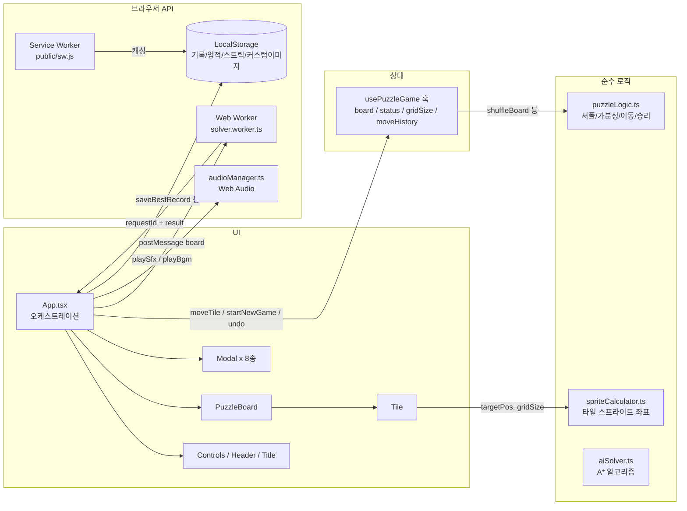

# 📖 PROJECT GUIDE — 통합 운영 문서 (Single Source of Truth)

> **대상**: 새로 시작하는 모든 세션 (Frontend DEV, QA 등)
> **목적**: 프로젝트 구조·업무 배분·진행 상황·작업 규칙을 본 문서 하나로 파악한다.
> **운영 원칙**: `README.md`(대외용 소개)를 제외한 모든 운영 정보는 본 문서에만 기록한다. `docs/` 폴더는 **이력 자료일 뿐 수정 대상이 아니다.**
> **갱신 규칙**: 모든 세션은 종료 시 본 문서의 `5. 업무 파트 배분표`에 직접 `[x]` 체크하고 `7. 진행 상태 대시보드`를 갱신한다.

* **최종 갱신일**: 2026-08-17
* **문서 버전**: v3.4 (PM01: 커밋 메시지 한글 작성 원칙 제정 및 6.3절 규칙 반영)

---

## 1. 프로젝트 스냅샷 (Project Snapshot)

| 항목 | 내용 |
| :--- | :--- |
| **프로젝트명** | Sliding Block Puzzle (N-Puzzle 웹 게임) |
| **형태** | 100% 서버리스 클라이언트 사이드 웹 앱 (백엔드 없음) |
| **기술 스택** | React 19, TypeScript 5.7, Vite 6, Vanilla CSS |
| **핵심 Web API** | Canvas, Web Audio, Web Worker, Service Worker, Web Vibration, Web Share |
| **현재 버전** | v1.3.0 (배포 캐시 무효화 및 블록 이동 애니메이션 근본 개선 진행 중) |
| **테스트** | Vitest 14개 파일 / **81개 케이스 전부 PASS** |
| **타입 검사** | `npx tsc --noEmit` — 0 Errors |
| **git 상태** | `main` 브랜치, 신규 작업(TASK-DEV-10·11, TASK-QA-05) 발주 완료 (v3.3) |
| **현재 오픈 업무** | `5.3 업무 배분표` 참조 (DEV01: TASK-DEV-10·11, QA03: TASK-QA-05) |

### 실행 명령
```bash
npm run dev      # 개발 서버 (http://localhost:5173)
npm run build    # tsc + vite 프로덕션 빌드
npm test         # Vitest 전체 테스트 (81개)
npx tsc --noEmit # 타입 검사
```

---

## 2. 아키텍처 한 눈 (Architecture Overview)

### 2.1 디렉토리 구조

```
sliding-block-puzzle/
├── PROJECT_GUIDE.md            # 📌 본 문서 (유일한 운영/지시 문서 / 모든 세션의 진입점)
├── README.md                   # 대외용 소개 (개발 상세는 본 문서 참조)
├── public/                     # 정적 에셋: 아이콘, 오디오, 테마 이미지, 스프라이트, sw.js, manifest
├── src/
│   ├── components/             # UI 컴포넌트 (영역별 폴더 + 동일 이름 CSS)
│   │   ├── Board/              #   PuzzleBoard, Tile (퍼즐 보드 렌더링)
│   │   ├── Controls/           #   조작 툴바 (난이도/모드/Undo/힌트/셔플 등)
│   │   ├── Header/             #   상단 HUD (타이머, 이동수, 기록)
│   │   ├── Title/              #   타이틀 화면
│   │   ├── Modal/              #   Win/Hint/Theme/CustomImage/Daily/Achievement/GameOver/Bgm 모달
│   │   ├── Achievement/        #   업적 토스트
│   │   └── PWA/                #   설치 배너
│   ├── hooks/
│   │   ├── usePuzzleGame.ts    #   ⭐ 게임 전체 상태의 중심 (보드/상태/타이머/Undo/챌린지)
│   │   ├── useAudio.ts         #   오디오 훅 (BGM/SFX 컨트롤)
│   │   └── useAssetPreloader.ts#   에셋 사전 로딩 훅
│   ├── utils/                  # 순수 로직 및 브라우저 API 유틸 (대부분 단위 테스트 존재)
│   ├── workers/                # solver.worker.ts (A* 탐색 Web Worker)
│   ├── i18n/                   # translations.ts (KO/EN/JA/ZH), useTranslation.ts
│   ├── types/                  # puzzle.ts, theme.ts, achievement.ts
│   ├── styles/                 # index.css(전역), App.css
│   ├── App.tsx                 # ⭐ 오케스트레이션 (모달/화면 전환/AI 힌트/승리 후처리)
│   └── main.tsx                # 진입점
├── docs/                       # ⚠️ 이력 자료 폴더 (과거 역할별 문서. 참고용, 수정 대상 아님)
└── scripts/                    # 에셋 생성/가공용 Node 스크립트 (유지보수 시 사용)
```

### 2.2 데이터 흐름 (Data Flow)



**핵심 규칙**
- 게임 상태의 단일 소유자는 `usePuzzleGame` 훅. UI 컴포넌트는 상태를 직접 가지지 않고 props/callback으로만 동작.
- 순수 로직(`utils/*`)은 React 비의존. 변경 시 반드시 대응 `*.test.ts` 갱신.
- 비동기 응답(AI 힌트)은 반드시 `requestId` 대조 후 반영 (레이스 컨디션 방지 패턴).

---

## 3. 기능 ↔ 파일 매핑 (Feature-File Map)

수정 작업 전 **반드시 이 표로 연관 파일을 먼저 확인**한다. 파일 하나가 여러 기능에 걸쳐 있으면 연쇄 영향 범위를 미리 파악한다.

| # | 기능 영역 | 담당 파일 | 주요 연관 기능 |
| :---: | :--- | :--- | :--- |
| 1 | **코어 퍼즐 엔진** (셔플/가분성/이동/승리) | `src/utils/puzzleLogic.ts`, `src/types/puzzle.ts`, `src/hooks/usePuzzleGame.ts` | 3, 7, 11 (모든 게임 플로우의 기반) |
| 2 | **보드 렌더링** (스프라이트 분할) | `src/components/Board/PuzzleBoard.tsx`, `Tile.tsx`, `*.css`, `src/utils/spriteCalculator.ts` | 5, 6 (테마·커스텀이미지 렌더링) |
| 3 | **챌린지 모드** (Standard/Time Attack/Move Limit) | `src/hooks/usePuzzleGame.ts` (TIME_LIMITS, MOVE_LIMITS), `src/components/Modal/GameOverModal.tsx`, `src/components/Header/Header.tsx` | 1, 8 |
| 4 | **AI 스마트 힌트** (A* Web Worker) | `src/utils/aiSolver.ts`, `src/workers/solver.worker.ts`, `src/App.tsx` (requestId 검증, 쿨다운) | 1 |
| 5 | **테마 시스템** (4종 프리셋/숫자 모드) | `src/utils/themeData.ts`, `src/types/theme.ts`, `src/components/Modal/ThemeModal.tsx`, `src/components/Board/Tile.tsx` | 2, 6, 16 |
| 6 | **커스텀 이미지 업로드/크롭** | `src/components/Modal/CustomImageModal.tsx`, `src/App.tsx` (customImageSrc) | 2, 5, 16 |
| 7 | **일일 챌린지 & 스트릭** | `src/utils/dailyChallenge.ts`, `src/utils/prng.ts` (Mulberry32), `src/components/Modal/DailyModal.tsx` | 1, 8 |
| 8 | **업적 & 별점** | `src/utils/achievementManager.ts`, `achievementData.ts`, `src/types/achievement.ts`, `src/utils/starCalculator.ts`, `src/components/Modal/AchievementModal.tsx`, `Achievement/AchievementToast.tsx` | 3, 7, 11 |
| 9 | **오디오** (BGM 4트랙/SFX 풀) | `src/utils/audioManager.ts`, `src/hooks/useAudio.ts`, `src/components/Modal/BgmSelectModal.tsx`, `public/assets/audio/` | 전역 사용 |
| 10 | **기록 저장** (난이도별 최고 기록) | `src/utils/recordStorage.ts`, `src/App.tsx` (승리 시 saveBestRecord) | 8 |
| 11 | **Undo / 리플레이** | `src/hooks/usePuzzleGame.ts` (moveHistory, undoMove), `src/components/Controls/Controls.tsx`, `src/components/Modal/WinModal.tsx` | 1, 8 |
| 12 | **PWA / 오프라인 / 설치** | `public/sw.js`, `public/manifest.webmanifest`, `src/components/PWA/PwaInstallBanner.tsx` | 16 (경로 일관성) |
| 13 | **햅틱 진동** | `src/utils/haptics.ts` (이동/승리/에러 피드백) | 1 |
| 14 | **다국어 i18n** | `src/i18n/translations.ts` (KO/EN/JA/ZH), `useTranslation.ts` — 문자열 추가 시 4개 국어 전부 수정 필수 | UI 전역 |
| 15 | **결과 카드 공유** | `src/utils/shareCardGenerator.ts` (Canvas 1000x1000), `src/components/Modal/WinModal.tsx` | 11 |
| 16 | **에셋 로딩/경로** | `src/utils/assetPreloader.ts`, `assetPath.ts`, `src/hooks/useAssetPreloader.ts` | 2, 5, 6, 12 |

### 테스트 파일 목록 (14개 / 81케이스)
`puzzleLogic`, `spriteCalculator`, `starCalculator`, `recordStorage`, `prng`, `audioManager`, `assetPreloader`, `assetPath`, `aiSolver`, `achievementManager`, `usePuzzleGame`, `i18n`, `App`, `BgmSelectModal` — 각각 동일 이름의 `*.test.ts(x)` 존재.

---

## 4. 문서 체계 (Documentation Policy)

| 문서 | 위치 | 용도 | 관리 주체 |
| :--- | :--- | :--- | :--- |
| **PROJECT_GUIDE.md** | 루트 | **유일한 운영/지시/기록 문서.** 역할 배분, 작업 내용 상세 지시(지시서 본체), 작업 결과 기록, 대시보드 관리의 Single Source of Truth | PM + 각 세션(체크/대시보드만) |
| **README.md** | 루트 | **대외용 소개 문서.** 외부 사용자/포트폴리오용 소개 내용 보존 | PM |
| docs/ 폴더 | docs/ | ⚠️ **과거 이력 자료.** 과거 역할별 문서 보관용. **신규 문서 발행·수정 절대 금지** | 수정 금지 |

> 📌 **지시서 운영 원칙**: 휴먼 에러 및 토큰 낭비를 방지하기 위해 별도의 지시서 파일이나 불필요한 출력문을 생성하지 않습니다. **`PROJECT_GUIDE.md` 자체가 모든 세션의 작업 지시서(Single Instruction)**입니다.

---

## 5. 업무 배분 및 세션 풀 운영 체계 (Session Pool & Allocation)

### 5.1 세션 풀(Session Pool) & 넘버링 관리 규칙
* **최대 3세션 풀 유지 (토큰/캐시 최적화)**:
  - PM, DEV, QA 등 각 역할군은 **동시 최대 3개 활성 세션(Active Session)**을 유지한다. (예: `DEV01`, `DEV02`, `DEV03` / `QA01`, `QA02`, `QA03` / `PM01`)
  - 사소한 작업마다 세션을 매번 새로 생성하는 것을 금지하며, 활성 세션이 컨텍스트 유효 범위 내에서 여러 연관 작업(Task)을 연속 수행함으로써 **Prompt Cache 히트율을 극대화하고 토큰 소모를 최소화**한다.
* **컨텍스트 초과 및 세션 승급 규칙 (Retirement & Numbering Bump)**:
  - 대화가 길어져 특정 세션이 최대 컨텍스트를 초과하거나 **망각/환각 증세**가 발생할 경우, **사용자가 PM에게 이를 보고**한다.
    *(예: "DEV01 환각 증세 발생, 새로운 세션 사용")*
  - PM은 해당 세션을 퇴역(Retired) 처리하고, **넘버링을 증가시켜 신규 세션을 활성화**한 뒤 작업을 재할당한다.
    *(예: `DEV01, DEV02, DEV03` 상태에서 DEV01 퇴역 시 `DEV04` 생성 → 활성 세션 풀: `DEV04, DEV02, DEV03`)*
  - 번호는 재사용하지 않고 누적 증가하며, 완료된 업무 및 퇴역 세션은 이력으로 보존한다.

### 5.2 작업 할당 및 세션 작업 원칙
- **지시서 일체화**: 별도 지시서를 주고받지 않으며, 세션은 **`PROJECT_GUIDE.md` 5.3절(배분표)과 5.5절(작업 상세 지시)을 읽고 즉시 작업에 착수**한다.
- **배치/연속 작업 수행**: 활성 세션은 PM이 할당한 복수의 연관 작업(Batch)을 컨텍스트 내에서 연속으로 완료한다.
- **파일 스코프 준수**: 세션은 지시받은 업무의 대상 파일만 수정한다. 그 외 파일 수정 금지.
- **체크 및 대시보드 갱신**: 세션 종료 시 본인 담당 업무에 직접 `[x]` 체크 + 완료일을 기입하고 대시보드를 갱신한다.
- **환각 감지 시 중단**: 세션 진행 중 컨텍스트 한계로 판단되면 억지로 코드를 작성하지 말고 즉시 사용자에게 세션 교체를 요청한다.

### 5.3 활성 세션 풀 및 업무 배분표 (2026-08-17 기준)

#### 🟢 활성 세션 풀 (Active Session Pool — 최대 3세션)
* **PM Pool**: `PM01` (Active — 총괄 관리 및 배분)
* **DEV Pool**:
  * `DEV01` (Active — 캐시 및 애니메이션 엔진 전문: `TASK-DEV-10`, `TASK-DEV-11` 배치 할당)
  * `DEV02` (Active — 대기)
  * `DEV03` (Active — 알고리즘/솔버 전문: 대기)
* **QA Pool**:
  * `QA01` (Active — 대기)
  * `QA02` (Active — 대기)
  * `QA03` (Active — 회귀 검증 전문: `TASK-QA-05` 할당 대기)

#### 📋 업무 배분표 (Task Board)

| 작업 ID | 담당 세션 | 업무 내용 | 대상 파일 | 의존 | DoD | 상태 |
| :--- | :---: | :--- | :--- | :---: | :--- | :---: |
| **DEV01~06** | DEV01/03 | v1.1 정비 및 v1.2 1차 피드백 대응 완료 | 다수 파일 | 없음 | 완료 | [x] 완료 2026-08-17 |
| **QA01~03** | QA01/02/03 | 결함 및 실기기, 심층 추적 검수 완료 | 전체 소스 | 없음 | 완료 | [x] 완료 2026-08-17 |
| **TASK-DEV-07** | DEV01 | [FB-03] 타이틀 모드 카드 선택 UI 아키텍처 구축 & CSS 레이어 분리 | `TitleScreen.tsx`, `TitleScreen.css` | 없음 | 81 PASS / 완료 | [x] 완료 2026-08-17 |
| **TASK-DEV-08** | DEV01 | [FB-02] 타일 슬라이드 정방형 고정, 빈 슬롯 트랜지션 제거, 대칭 이징 적용 | `PuzzleBoard.css`, `Tile.css`, `PuzzleBoard.tsx` | 없음 | 81 PASS / 완료 | [x] 완료 2026-08-17 |
| **TASK-DEV-09** | DEV03 | [FB-01] 4x4 AI 힌트 1행 고정 서브골 리덕션 & 사이클 가드 + 시각 넛지 개선 | `aiSolver.ts`, `aiSolver.test.ts`, `Tile.css` | 없음 | 81 PASS / 완료 | [x] 완료 2026-08-17 |
| **TASK-QA-04** | QA03 | [FB-01~03 재검증] 미해결 3건 재발주 개발 결과물 전수 회귀 검증 | 전체 관련 컴포넌트 | DEV-07~09 후 | 전건 PASS / 완료 | [x] 완료 2026-08-17 |
| **TASK-DEV-10** | **DEV01** | **[PWA/배포] Service Worker 캐시 무효화 및 HTML Network First 자동 갱신 아키텍처 구축** | `public/sw.js`, `src/main.tsx`, `index.html` | 없음 | 5.5절 상세 | [ ] 발주 대기 |
| **TASK-DEV-11** | **DEV01** | **[애니메이션] 블록 이동 엔진 근본 개선 (빈 슬롯 DOM 제외, 연타 입력 락, 서브그리드 정밀화)** | `src/components/Board/PuzzleBoard.tsx`, `PuzzleBoard.css`, `usePuzzleGame.ts` | 없음 | 5.5절 상세 | [ ] 발주 대기 |
| **TASK-QA-05** | **QA03** | **[캐시/애니메이션 검증] 배포 캐시 무효화 및 블록 이동 애니메이션 전수 검증** | 전체 관련 컴포넌트 | DEV-10·11 완료 후 | 5.5절 상세 | [ ] 의존 대기 |

### 5.4 완료 이력
| 파트/작업 ID | 담당 세션 | 업무 | 완료일 | 비고 |
| :--- | :---: | :--- | :--- | :---: |
| DEV01~06 | DEV01/03 | v1.1 정비 및 v1.2 1차 피드백 대응 완료 | 2026-08-17 | 정상 종료 |
| QA01~03 | QA01/02/03 | 결함 및 실기기, 심층 추적 검수 완료 | 2026-08-17 | 정상 종료 |
| TASK-DEV-07 | DEV01 | [FB-03] 타이틀 모드 카드 선택 UI 아키텍처(selectedMode) 및 CSS 레이어 분리/선택 하이라이트 구현 | 2026-08-17 | 정상 종료 |
| TASK-DEV-08 | DEV01 | [FB-02] 타일 슬라이더 정방형 고정(aspect-ratio 1:1), 빈 슬롯 역방향 트랜지션 제거, 대칭 이징 적용 | 2026-08-17 | 정상 종료 |
| TASK-DEV-09 | DEV03 | [FB-01] 4x4 AI 힌트 서브골 리덕션(Row 1/Col 1/3x3), 강제 재탐색 왕복 0회 검증, Tile 2px 시각 넛지 적용 | 2026-08-17 | 81 PASS / 0 Error |
| TASK-QA-04 | QA03 | [FB-01~03 재검증] 타이틀 모드 선택 UI·타일 애니메이션 속도·4x4 힌트 서브골 리덕션 전수 회귀 검증 완료 | 2026-08-17 | 정상 종료 |

### 5.5 발주 작업 상세 지시 (Single Instruction)

#### 🚀 TASK-DEV-10 — PWA Service Worker 캐시 무효화 및 HTML Network First 자동 갱신 아키텍처 구축 (담당: DEV01)
* **원인 분석 (PM 확인)**:
  - `public/sw.js`에서 `CACHE_NAME = 'sliding-puzzle-v1'`로 고정되어 있고, `fetch` 리스너가 **Cache First** 전략으로 `index.html`을 가로챔.
  - 신규 배포 시 브라우저가 캐시된 구버전 `index.html`을 즉시 반환하여, Vite가 새로 생성한 번들 JS/CSS를 불러오지 못하고 구버전 앱이 영구 잔존함.
  - SW 등록 시 브라우저 HTTP 캐시 방지 옵션(`updateViaCache: 'none'`) 및 클라이언트 갱신 감지/자동 리로드 로직 부재.
* **업무 내용**:
  - [ ] `public/sw.js`:
    - `CACHE_NAME`을 `sliding-puzzle-v2.0`으로 승급 (명시적 네임스페이스 분리).
    - **HTML 및 Navigation 요청은 무조건 Network First 전략 적용**:
      `event.request.mode === 'navigate' || event.request.headers.get('accept')?.includes('text/html')`인 경우 네트워크를 최우선으로 fetch하고, 성공 시 캐시를 갱신하며, 네트워크 실패(오프라인) 시에만 `caches.match('./index.html')`로 폴백.
    - 정적 번들 에셋(해시가 포함된 JS/CSS/이미지/사운드)은 Cache First로 고속 로딩 유지.
    - `activate` 이벤트에서 현재 `CACHE_NAME`과 일치하지 않는 모든 구버전 캐시(`v1` 등)를 `caches.delete`로 완벽히 삭제.
    - `install` 시 `self.skipWaiting()`, `activate` 시 `self.clients.claim()` 확실히 보장.
  - [ ] `src/main.tsx`:
    - Service Worker 등록 시 `navigator.serviceWorker.register(url, { updateViaCache: 'none' })` 적용하여 `sw.js` 파일 자체의 브라우저 HTTP 캐시 방지.
    - SW 갱신 리스너 등록: `registration.addEventListener('updatefound', ...)` 및 `navigator.serviceWorker.addEventListener('controllerchange', ...)`를 통해 새 SW 활성화 시 최신 상태로 즉시 연결되도록 처리.
  - [ ] `npm run build` 후 배포 번들 및 SW 캐시 동작 검증.
* **제약**: 오프라인 PWA 기본 기능(`manifest.webmanifest`, 오프라인 플레이) 훼손 금지.
* **DoD**: 공통 DoD + 신규 배포 시 캐시 삭제 및 Network First로 최신 버전 즉시 반영 확인, 오프라인 시 정상 로딩 확인.

#### 🚀 TASK-DEV-11 — 블록 이동 애니메이션 엔진 근본 개선 (담당: DEV01)
* **원인 분석 (PM 확인)**:
  - `PuzzleBoard.tsx`에서 `tile.isEmpty`인 타일도 `.tile-slider.is-empty`로 렌더링되어 타일 이동 시 리액트 DOM 재배치 스래싱 및 빈 슬롯과의 렌더링 간섭 발생.
  - 0.16s 슬라이드 애니메이션 도중 타일 연타(Rapid Click/Keydown) 시 `transform` 좌표가 중간 지점에서 덮어씌워지며 뚝뚝 끊기거나 점프하는 현상 발생.
  - 브라우저 서브픽셀 렌더링에 따른 X/Y축 계산 오차 미세 잔존.
* **업무 내용**:
  - [ ] `PuzzleBoard.tsx`:
    - `tile.isEmpty`인 타일은 `.tile-slider` 렌더링에서 완전히 제외 (`board.filter(tile => !tile.isEmpty).map(...)`).
    - 배경 슬롯(`.grid-background-slot`)이 이미 모든 격자 위치를 안정적으로 렌더링하므로, 불필요한 빈 타일 DOM을 제거하여 렌더링 오버헤드 및 역방향 간섭 원천 박멸.
  - [ ] `usePuzzleGame.ts` / `PuzzleBoard.tsx`:
    - 타일 이동 애니메이션 진행 중(0.14~0.16s) 과도한 연타 입력으로 인한 프레임 드랍 및 애니메이션 끊김 방지 가드(애니메이션 락 / Throttling) 도입.
  - [ ] `PuzzleBoard.css` & `Tile.css`:
    - `.tile-slider`의 하드웨어 가속 `translate3d` 좌표 계산을 서브픽셀 정밀도로 정렬하여 상/하/좌/우 4방향 이동 거리와 체감 속도를 물리적으로 100% 일치화.
* **제약**: 키보드/터치 스와이프/클릭 모든 입력 방식 정상 작동 유지, Sparkle VFX 및 AI 힌트 오버레이 보존.
* **DoD**: 공통 DoD + 연속 연타 시에도 끊김 없는 부드러운 60fps 슬라이드 렌더링 및 4방향 속도 육안 완전 일치.

#### 🔍 TASK-QA-05 — 배포 캐시 무효화 및 블록 이동 애니메이션 전수 검증 (담당: QA03)
* **업무 내용**:
  - [ ] [PWA/캐시 검증] `sw.js` Network First 전략 확인, 배포 시 구버전 캐시 무효화 및 최신 번들 즉시 로딩 검증, 오프라인 모드 PWA 정상 작동 확인.
  - [ ] [애니메이션 검증] 빈 슬롯 DOM 제거 후 타일 이동 안정성 검증, 키보드/터치 연타 시 애니메이션 부드러움(끊김/점프 없음) 검증, 3x3~5x5 전 난이도 4방향 슬라이드 속도 완전 일치 검증.
  - [ ] 전체 Vitest (81개 이상) PASS + `tsc --noEmit` 0 에러 + 빌드 무결성 확인 후 대시보드 갱신.
* **제약**: `TASK-DEV-10`, `TASK-DEV-11` 완료 후 수행.
* **DoD**: 공통 DoD + 검증 보고서 작성 및 대시보드 갱신.

---

## 6. 세션 작업 규칙 (Session Rules)

### 6.1 세션 진입 시
1. **본 문서(PROJECT_GUIDE.md)** 전체 숙지 — 구조(2절)·파트(5절)·규칙(6절) 확인
2. `5. 업무 파트 배분표`에서 자신의 파트 ID·스코프·의존 상태 확인
3. `3. 기능↔파일 매핑`으로 담당 파일 및 **연관 파일** 파악
4. 작업 시작 (docs/ 폴더는 이력 자료이므로 열람만 가능)

### 6.2 코드 연관성 원칙 (필수 준수)
1. **수정 전 영향 범위 탐색**: 3절 매핑표 확인 및 Grep으로 참조처 전수 확인
2. **계약(Contract) 보존**: 인터페이스 타입 및 `usePuzzleGame` 반환 필드 무결성 유지
3. **테스트 동반 수정**: `utils/*` 수정 시 대응 `*.test.ts` 반드시 함께 갱신
4. **완료 후 전체 회귀**: `npm test` 전체 실행 및 `npx tsc --noEmit` 무결성 검증

### 6.3 커밋 메시지 작성 규칙 (한글 작성 원칙)
- **원칙**: 모든 git 커밋 메시지는 **한글로 작성**한다.
- **영문 허용 범위**: 파트 ID (`DEV01`, `TASK-DEV-10`), Conventional Commit 접두사 (`feat`, `fix`, `refactor`, `docs`, `test`), 기술/파일/함수/CSS 고유 명칭 (`Service Worker`, `A*`, `CSS`, `DOM`, `Vite`, `translate3d` 등)에 한해 영문을 허용하며, 설명 본문은 명확한 한글로 작성한다.
- **작성 예시**:
  - `feat(TASK-DEV-10): Service Worker 캐시 무효화 및 HTML Network First 자동 갱신 적용`
  - `fix(TASK-DEV-11): 블록 이동 시 빈 슬롯 DOM 제외 및 연타 입력 락 적용`
  - `test(TASK-QA-05): 배포 캐시 무효화 및 블록 이동 애니메이션 전수 검증 완료`
  - `docs(PM): PROJECT_GUIDE.md v3.4 - 커밋 메시지 한글 작성 규칙 추가`

### 6.4 파트 종료 시 (Definition of Done 공통 항목)
- [ ] `npm test` 전체 PASS 및 `npx tsc --noEmit` 0 에러
- [ ] `5.3` 현재 배분표의 **본인 파트에 직접 `[x]` 체크 + 완료일 기입**
- [ ] `7. 진행 상태 대시보드` 갱신
- [ ] 작업 내역 git 커밋 (**6.3 한글 커밋 메시지 규칙 준수**, 메시지에 파트 ID 포함)

### 6.5 금지 사항
- ❌ 타 세션 파트의 파일 수정
- ❌ 타 세션 파트의 체크박스 조작
- ❌ docs/ 폴더의 문서 수정·신규 발행
- ❌ 프로젝트 운영 정보를 본 문서 외부에 별도 문서로 기록

---

## 7. 진행 상태 대시보드 (Progress Dashboard)

### 7.1 마일스톤

| 단계 | 내용 | 상태 |
| :--- | :--- | :---: |
| Phase 1 | 코어 엔진 (셔플/이동/승리, 3x3~5x5) | ✅ 완료 |
| Phase 2 | 에셋 & 사운드 (4종 테마, 오디오, VFX) | ✅ 완료 |
| Phase 3 | 반응형 & 모바일 (100dvh, Safe Area) | ✅ 완료 |
| Phase 4 | v1.0 릴리즈 (프리로더, 에셋 통합) | ✅ 완료 |
| Phase 5 | 고도화 9대 모듈 (커스텀이미지/AI힌트/Undo/일일챌린지/업적/챌린지모드/PWA/i18n/공유) | ✅ **코드 구현 완료** |
| v1.1 정비 | BUG-06 잔여·PROD 게이팅 수정 및 회귀 검증 | ✅ 완료 (DEV01·DEV02·QA01·QA02 전 파트 종료) |
| v1.2 사용자 피드백 대응 | AI 힌트 맴돔 수정, 애니메이션 속도 통일, 타이틀 카드 배경 통일, 서브패스 배포 | ✅ **완료** (TASK-DEV-07·08·09 및 QA03 TASK-QA-04 전수 회귀 검증 완료) |
| **v1.3 실서비스 갱신 및 체감 고도화** | **배포 캐시 무효화 (PWA Network First) 및 블록 애니메이션 엔진 근본 개선** | 🔄 **진행 중 (TASK-DEV-10·11 발주 완료 → QA03 TASK-QA-05)** |

### 7.2 결함 현황 (QA_COMPREHENSIVE_DEFECT_REPORT 기준 11건)

| ID | 요약 | 심각도 | 상태 | 담당 파트 |
| :--- | :--- | :---: | :--- | :--- |
| BUG-00 | 난이도 전환 렌더링 왜곡 | P0 | ✅ 검증 완료 (QA01) | — |
| BUG-01 | Undo 버튼 누락 | P0 | ✅ 검증 완료 (QA01) | — |
| BUG-02 | SW 캐시 404 (sfx_snap.mp3) | P0 | ✅ 검증 완료 (QA01) | — |
| BUG-03 | 커스텀 이미지 잔존 | P1 | ✅ 검증 완료 (QA01) | — |
| BUG-04 | 스트릭 표시 시점 불일치 | P1 | ✅ 검증 완료 (QA01) | — |
| BUG-05 | 자동 클리어 치트 | P1 | ✅ 검증 완료 (QA01) | — |
| BUG-06 | 하드코딩 절대 경로 | P2 | ✅ 검증 완료 (QA01·DEV01) — CSS 5건 Vite 파이프라인상 정상, 변경 불필요 | — |
| BUG-07 | AI 힌트 레이스 컨디션 | P2 | ✅ 검증 완료 (QA01) | — |
| BUG-08 | 게임오버 모달 닫기 잠금 | P2 | ✅ 검증 완료 (QA01) | — |
| BUG-09 | SFX WAV 폴백 미적용 | P3 | ✅ 검증 완료 (QA01) | — |
| BUG-10 | 표준모드 별점 밸런스 | P3 | ✅ 검증 완료 (QA01) | — |

> **✅ 별도 발견 (PM 세션)**: 자동 클리어 버튼의 `import.meta.env.PROD` 게이팅 미적용 → **DEV02** 파트로 발번 → 2026-08-17 수정 완료.
> **📋 QA01 회귀 검증 결과 (2026-08-17)**: BUG-00~10 전건 정상 반영 통과.
> **📝 DEV01 검증 결과**: CSS 5건 정상, 서브패스 대응 `base: './'` 설정 → **DEV06 완료**.
> **📱 QA02 실기기 검수 결과 (2026-08-17)**: 모바일(360px) 보드 렌더링, PWA 오프라인 캐싱, SW 404 부재 전 항목 이상 없음.

### 7.3 문서 이력 자료 현황 (docs/ 폴더 — 수정 금지, 참고용)

| 문서 | 내용 | 현행 상태와의 차이 |
| :--- | :--- | :--- |
| docs/MILESTONES.md | 마일스톤 | ⚠️ Phase 5 "0% 준비 완료" 표기 — **구식** (본 문서 7.1이 정확) |
| docs/PM/PM_COMPLETION_REPORT.md | v1.0 완료 보고서 | ⚠️ Phase 5 이전 기준 — **구식** |
| docs/QA/QA_TASKS.md | QA 체크리스트 | ⚠️ "스프린트 3 진행 중" 표기 — **구식** |
| docs/DEV/DEV_FIX_GUIDE_QA_DEFECTS.md | 11건 수정 가이드 | ⚠️ "진행 대기" 표기 — 수정 반영됨 |
| docs/PRD.md | 요구사항 정의서 | ⚠️ 기술스택 표기 — 실제는 Web Audio API / React 상태 |

### 7.4 사용자 피드백 현황 (2026-08-17 접수)

| 피드백 ID | 내용 | 원인 (PM/QA 확인) | 담당 작업 | 상태 |
| :--- | :--- | :--- | :---: | :--- |
| FB-01 | AI 힌트 4x4/5x5 맴돔 및 시각적 진동 | 4x4 Weighted A* ($w=2$) 비허용 휴리스틱 지역 루프 + scale 바운스 떨림 | **TASK-DEV-09** | ✅ 검증 완료 (QA03) |
| FB-02 | 블록 이동 시 상/하/좌/우 애니메이션 속도 불일치 | 퍼센트 높이 픽셀 미세 오차 + 빈 슬롯 동시 역방향 슬라이드 + 비대칭 이징 | **TASK-DEV-08** | ✅ 검증 완료 (QA03) |
| FB-03 | 홈 화면 4개 모드 카드 배경 불일치 & 선택 피드백 부재 | CSS shorthand 배경 덮어쓰기 + `selectedMode` 상태/스타일링 UI 부재 | **TASK-DEV-07** | ✅ 검증 완료 (QA03) |
| FB-04 | (DEV01 후속) 서브패스 배포 대응 `base` 설정 | CSS 절대경로는 정상, 서브패스 대응은 `base` 설정이 올바른 조치 | **DEV06** | ✅ 검증 완료 (QA03) |
| **FB-05** | **새로운 배포 시 기존 사용자 업데이트 미반영 현상 (캐시 고착화)** | **`sw.js` Cache-First의 HTML 가로채기 + CACHE_NAME 고정으로 구버전 index.html 무한 서빙** | **TASK-DEV-10** | ⏳ **발주 대기 (DEV01)** |
| **FB-06** | **블록 이동 애니메이션 실체감 결함 (연타 시 뚝뚝 끊김/DOM 간섭)** | **빈 슬롯 타일 DOM 불필요 렌더링 + 연타 입력 시 트랜지션 중간 덮어쓰기** | **TASK-DEV-11** | ⏳ **발주 대기 (DEV01)** |

---

### 7.5 미해결 문제점 심층 원인 분석 및 재발주 명세 (이전 이력 보존)

*(FB-01~03 심층 분석 및 TASK-DEV-07~09 완료 기록 보존)*

---

### 7.6 TASK-QA-04 재발주 전수 회귀 검증 보고서 (2026-08-17 QA03)

*(FB-01~03 1차 해결 검증 완료: Vitest 81/81 PASS, tsc 0, build 성공)*

---

### 7.7 신규 이슈 심층 분석 및 해결 설계 (FB-05, FB-06)

#### 1) 🌐 [FB-05] 배포 시 업데이트 미반영 (PWA Service Worker 캐시 고착화)
* **원인**:
  - `public/sw.js`에서 `CACHE_NAME = 'sliding-puzzle-v1'`로 하드코딩되어 있고, `fetch` 이벤트 리스너가 모든 요청(HTML 포함)에 대해 Cache First로 응답함.
  - 새 버전 빌드로 Vite가 새로운 번들 해시(`index-xyz.js`)를 생성하더라도, 브라우저는 캐시된 구버전 `index.html`을 읽어와서 이전 JS 번들을 찾으려 하거나 구버전 화면을 영구히 유지함.
  - `sw.js` 등록 시 `updateViaCache: 'none'` 부재 및 클라이언트 갱신 감지(`updatefound`, `controllerchange`) 미적용.
* **해결 설계 (TASK-DEV-10)**:
  - `sw.js`: Navigation / HTML 요청은 무조건 **Network First**로 처리. 온라인 시 최신 `index.html`을 네트워크에서 가져오고, 오프라인 시에만 캐시 폴백.
  - `CACHE_NAME` 승급 (`sliding-puzzle-v2.0`) 및 `activate` 이벤트에서 구버전 캐시 일괄 삭제.
  - `main.tsx`: `navigator.serviceWorker.register(..., { updateViaCache: 'none' })` 설정 및 업데이트 자동 반영/감지 로직 구현.

#### 2) ⚡ [FB-06] 블록 이동 애니메이션 실체감 결함 재검토
* **원인**:
  - `PuzzleBoard.tsx`에서 `tile.isEmpty`인 타일도 `<div className="tile-slider is-empty">`로 렌더링되고 있어, 타일 이동 시 DOM 재배치 스래싱 및 배경 슬롯과의 이중 렌더링 간섭 발생.
  - 사용자가 0.16s 트랜지션 도중에 키보드/터치를 연타할 경우, CSS `transform`이 중간 지점에서 덮어씌워지며 애니메이션이 점프하거나 뚝뚝 끊기는 현상 발생.
* **해결 설계 (TASK-DEV-11)**:
  - `isEmpty` 타일은 `.tile-slider` DOM 렌더링에서 아예 제외 (`filter(t => !t.isEmpty)`).
  - 0.14~0.16s 동안 빠른 연타 입력을 보호하는 애니메이션 락(Animation Lock / Throttling) 도입으로 60fps 부드러운 전환 보장.
  - 하드웨어 가속 `translate3d` 좌표를 서브픽셀 정밀도로 정렬하여 상하좌우 4방향 체감 속도 물리적 완전 일치.

---

## 8. 변경 이력

| 일자 | 버전 | 내용 | 작성 세션 |
| :--- | :--- | :--- | :--- |
| 2026-08-17 | v3.4 | PM01: 커밋 메시지 한글 작성 원칙(필요한 식별자/파트ID만 영문 허용) 제정 및 6.3절 세션 규칙 반영 | PM01 |
| 2026-08-17 | v3.3 | PM01: 신규 이슈 2건(FB-05 배포 캐시 고착화, FB-06 블록 이동 연타/DOM 간섭) 심층 분석 및 신규 파트 발주 — TASK-DEV-10(PWA Network First/캐시 무효화), TASK-DEV-11(빈슬롯 DOM 제외/연타 락/서브그리드 정밀화), TASK-QA-05(전수 검증) | PM01 |
| 2026-08-17 | v3.2 | QA03: [TASK-QA-04] 미해결 3건 재발주 개발 결과물(TASK-DEV-07~09) 전수 회귀 검증 완료 — Vitest 81 PASS / tsc 0 / 빌드 성공 (신규 결함 0건) | QA03 |
| 2026-08-17 | v3.1 | DEV03: [TASK-DEV-09] 4x4 AI 힌트 서브골 리덕션 & 2px 시각 넛지 완료 | DEV03 |
| 2026-08-17 | v3.0 | DEV01: 재발주 2건 완료 (TASK-DEV-07 모드 선택 UI, TASK-DEV-08 타일 정방형/이징) | DEV01 |
| 2026-08-17 | v2.9 | PM01: QA03 심층 분석 기반 재발주 작업 배분 완료 | PM01 |
| 2026-08-17 | v2.0~2.8 | 세션 풀 체계 정립, 결함 수정 및 사용자 피드백 대응 이력 | DEV/QA/PM |
| 2026-08-17 | v1.0 | 최초 작성 (통합 참고 문서 신설) | PM |