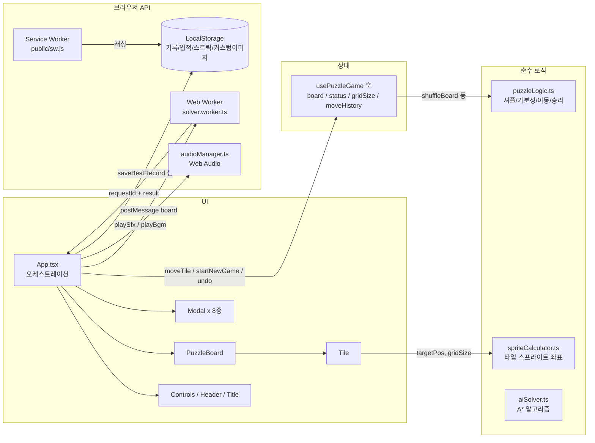

# 📖 PROJECT GUIDE — 통합 운영 문서 (Single Source of Truth)

> **대상**: 새로 시작하는 모든 세션 (Frontend DEV, QA 등)
> **목적**: 프로젝트 구조·업무 배분·진행 상황·작업 규칙을 본 문서 하나로 파악한다.
> **운영 원칙**: `README.md`(대외용 소개)를 제외한 모든 운영 정보는 본 문서에만 기록한다. `docs/` 폴더는 **이력 자료일 뿐 수정 대상이 아니다.**
> **갱신 규칙**: 모든 세션은 종료 시 본 문서의 `5. 업무 파트 배분표`에 직접 `[x]` 체크하고 `7. 진행 상태 대시보드`를 갱신한다.

* **최종 갱신일**: 2026-08-17
* **문서 버전**: v3.0 (DEV01: TASK-DEV-07, TASK-DEV-08 완료)

---

## 1. 프로젝트 스냅샷 (Project Snapshot)

| 항목 | 내용 |
| :--- | :--- |
| **프로젝트명** | Sliding Block Puzzle (N-Puzzle 웹 게임) |
| **형태** | 100% 서버리스 클라이언트 사이드 웹 앱 (백엔드 없음) |
| **기술 스택** | React 19, TypeScript 5.7, Vite 6, Vanilla CSS |
| **핵심 Web API** | Canvas, Web Audio, Web Worker, Service Worker, Web Vibration, Web Share |
| **현재 버전** | v1.2.2 (Phase 1~5 및 v1.1 정비 완료, TASK-DEV-07·08 완료) |
| **테스트** | Vitest 14개 파일 / **79개 케이스 전부 PASS** |
| **타입 검사** | `npx tsc --noEmit` — 0 Errors |
| **git 상태** | `main` 브랜치, DEV01 재발주 작업(TASK-DEV-07·08) 완료 (v3.0), working tree clean |
| **현재 오픈 업무** | `5.3 업무 배분표` 참조 (DEV03: TASK-DEV-09, QA03: TASK-QA-04) |

### 실행 명령
```bash
npm run dev      # 개발 서버 (http://localhost:5173)
npm run build    # tsc + vite 프로덕션 빌드
npm test         # Vitest 전체 테스트 (79개)
npx tsc --noEmit # 타입 검사
```

---

## 2. 아키텍처 한 눈 (Architecture Overview)

### 2.1 디렉토리 구조

```
sliding-block-puzzle/
├── PROJECT_GUIDE.md            # 📌 본 문서 (유일한 운영/지시 문서 / 모든 세션의 진입점)
├── README.md                   # 대외용 소개 (개발 상세는 본 문서 참조)
├── public/                     # 정적 에셋: 아이콘, 오디오, 테마 이미지, 스프라이트, sw.js, manifest
├── src/
│   ├── components/             # UI 컴포넌트 (영역별 폴더 + 동일 이름 CSS)
│   │   ├── Board/              #   PuzzleBoard, Tile (퍼즐 보드 렌더링)
│   │   ├── Controls/           #   조작 툴바 (난이도/모드/Undo/힌트/셔플 등)
│   │   ├── Header/             #   상단 HUD (타이머, 이동수, 기록)
│   │   ├── Title/              #   타이틀 화면
│   │   ├── Modal/              #   Win/Hint/Theme/CustomImage/Daily/Achievement/GameOver/Bgm 모달
│   │   ├── Achievement/        #   업적 토스트
│   │   └── PWA/                #   설치 배너
│   ├── hooks/
│   │   ├── usePuzzleGame.ts    #   ⭐ 게임 전체 상태의 중심 (보드/상태/타이머/Undo/챌린지)
│   │   ├── useAudio.ts         #   오디오 훅 (BGM/SFX 컨트롤)
│   │   └── useAssetPreloader.ts#   에셋 사전 로딩 훅
│   ├── utils/                  # 순수 로직 및 브라우저 API 유틸 (대부분 단위 테스트 존재)
│   ├── workers/                # solver.worker.ts (A* 탐색 Web Worker)
│   ├── i18n/                   # translations.ts (KO/EN/JA/ZH), useTranslation.ts
│   ├── types/                  # puzzle.ts, theme.ts, achievement.ts
│   ├── styles/                 # index.css(전역), App.css
│   ├── App.tsx                 # ⭐ 오케스트레이션 (모달/화면 전환/AI 힌트/승리 후처리)
│   └── main.tsx                # 진입점
├── docs/                       # ⚠️ 이력 자료 폴더 (과거 역할별 문서. 참고용, 수정 대상 아님)
└── scripts/                    # 에셋 생성/가공용 Node 스크립트 (유지보수 시 사용)
```

### 2.2 데이터 흐름 (Data Flow)



**핵심 규칙**
- 게임 상태의 단일 소유자는 `usePuzzleGame` 훅. UI 컴포넌트는 상태를 직접 가지지 않고 props/callback으로만 동작.
- 순수 로직(`utils/*`)은 React 비의존. 변경 시 반드시 대응 `*.test.ts` 갱신.
- 비동기 응답(AI 힌트)은 반드시 `requestId` 대조 후 반영 (레이스 컨디션 방지 패턴).

---

## 3. 기능 ↔ 파일 매핑 (Feature-File Map)

수정 작업 전 **반드시 이 표로 연관 파일을 먼저 확인**한다. 파일 하나가 여러 기능에 걸쳐 있으면 연쇄 영향 범위를 미리 파악한다.

| # | 기능 영역 | 담당 파일 | 주요 연관 기능 |
| :---: | :--- | :--- | :--- |
| 1 | **코어 퍼즐 엔진** (셔플/가분성/이동/승리) | `src/utils/puzzleLogic.ts`, `src/types/puzzle.ts`, `src/hooks/usePuzzleGame.ts` | 3, 7, 11 (모든 게임 플로우의 기반) |
| 2 | **보드 렌더링** (스프라이트 분할) | `src/components/Board/PuzzleBoard.tsx`, `Tile.tsx`, `*.css`, `src/utils/spriteCalculator.ts` | 5, 6 (테마·커스텀이미지 렌더링) |
| 3 | **챌린지 모드** (Standard/Time Attack/Move Limit) | `src/hooks/usePuzzleGame.ts` (TIME_LIMITS, MOVE_LIMITS), `src/components/Modal/GameOverModal.tsx`, `src/components/Header/Header.tsx` | 1, 8 |
| 4 | **AI 스마트 힌트** (A* Web Worker) | `src/utils/aiSolver.ts`, `src/workers/solver.worker.ts`, `src/App.tsx` (requestId 검증, 쿨다운) | 1 |
| 5 | **테마 시스템** (4종 프리셋/숫자 모드) | `src/utils/themeData.ts`, `src/types/theme.ts`, `src/components/Modal/ThemeModal.tsx`, `src/components/Board/Tile.tsx` | 2, 6, 16 |
| 6 | **커스텀 이미지 업로드/크롭** | `src/components/Modal/CustomImageModal.tsx`, `src/App.tsx` (customImageSrc) | 2, 5, 16 |
| 7 | **일일 챌린지 & 스트릭** | `src/utils/dailyChallenge.ts`, `src/utils/prng.ts` (Mulberry32), `src/components/Modal/DailyModal.tsx` | 1, 8 |
| 8 | **업적 & 별점** | `src/utils/achievementManager.ts`, `achievementData.ts`, `src/types/achievement.ts`, `src/utils/starCalculator.ts`, `src/components/Modal/AchievementModal.tsx`, `Achievement/AchievementToast.tsx` | 3, 7, 11 |
| 9 | **오디오** (BGM 4트랙/SFX 풀) | `src/utils/audioManager.ts`, `src/hooks/useAudio.ts`, `src/components/Modal/BgmSelectModal.tsx`, `public/assets/audio/` | 전역 사용 |
| 10 | **기록 저장** (난이도별 최고 기록) | `src/utils/recordStorage.ts`, `src/App.tsx` (승리 시 saveBestRecord) | 8 |
| 11 | **Undo / 리플레이** | `src/hooks/usePuzzleGame.ts` (moveHistory, undoMove), `src/components/Controls/Controls.tsx`, `src/components/Modal/WinModal.tsx` | 1, 8 |
| 12 | **PWA / 오프라인 / 설치** | `public/sw.js`, `public/manifest.webmanifest`, `src/components/PWA/PwaInstallBanner.tsx` | 16 (경로 일관성) |
| 13 | **햅틱 진동** | `src/utils/haptics.ts` (이동/승리/에러 피드백) | 1 |
| 14 | **다국어 i18n** | `src/i18n/translations.ts` (KO/EN/JA/ZH), `useTranslation.ts` — 문자열 추가 시 4개 국어 전부 수정 필수 | UI 전역 |
| 15 | **결과 카드 공유** | `src/utils/shareCardGenerator.ts` (Canvas 1000x1000), `src/components/Modal/WinModal.tsx` | 11 |
| 16 | **에셋 로딩/경로** | `src/utils/assetPreloader.ts`, `assetPath.ts`, `src/hooks/useAssetPreloader.ts` | 2, 5, 6, 12 |

### 테스트 파일 목록 (14개 / 79케이스)
`puzzleLogic`, `spriteCalculator`, `starCalculator`, `recordStorage`, `prng`, `audioManager`, `assetPreloader`, `assetPath`, `aiSolver`, `achievementManager`, `usePuzzleGame`, `i18n`, `App`, `BgmSelectModal` — 각각 동일 이름의 `*.test.ts(x)` 존재.

---

## 4. 문서 체계 (Documentation Policy)

| 문서 | 위치 | 용도 | 관리 주체 |
| :--- | :--- | :--- | :--- |
| **PROJECT_GUIDE.md** | 루트 | **유일한 운영/지시/기록 문서.** 역할 배분, 작업 내용 상세 지시(지시서 본체), 작업 결과 기록, 대시보드 관리의 Single Source of Truth | PM + 각 세션(체크/대시보드만) |
| **README.md** | 루트 | **대외용 소개 문서.** 외부 사용자/포트폴리오용 소개 내용 보존 | PM |
| docs/ 폴더 | docs/ | ⚠️ **과거 이력 자료.** 과거 역할별 문서 보관용. **신규 문서 발행·수정 절대 금지** | 수정 금지 |

> 📌 **지시서 운영 원칙**: 휴먼 에러 및 토큰 낭비를 방지하기 위해 별도의 지시서 파일이나 불필요한 출력문을 생성하지 않습니다. **`PROJECT_GUIDE.md` 자체가 모든 세션의 작업 지시서(Single Instruction)**입니다.

---

## 5. 업무 배분 및 세션 풀 운영 체계 (Session Pool & Allocation)

### 5.1 세션 풀(Session Pool) & 넘버링 관리 규칙
* **최대 3세션 풀 유지 (토큰/캐시 최적화)**:
  - PM, DEV, QA 등 각 역할군은 **동시 최대 3개 활성 세션(Active Session)**을 유지한다. (예: `DEV01`, `DEV02`, `DEV03` / `QA01`, `QA02`, `QA03` / `PM01`)
  - 사소한 작업마다 세션을 매번 새로 생성하는 것을 금지하며, 활성 세션이 컨텍스트 유효 범위 내에서 여러 연관 작업(Task)을 연속 수행함으로써 **Prompt Cache 히트율을 극대화하고 토큰 소모를 최소화**한다.
* **컨텍스트 초과 및 세션 승급 규칙 (Retirement & Numbering Bump)**:
  - 대화가 길어져 특정 세션이 최대 컨텍스트를 초과하거나 **망각/환각 증세**가 발생할 경우, **사용자가 PM에게 이를 보고**한다.
    *(예: "DEV01 환각 증세 발생, 새로운 세션 사용")*
  - PM은 해당 세션을 퇴역(Retired) 처리하고, **넘버링을 증가시켜 신규 세션을 활성화**한 뒤 작업을 재할당한다.
    *(예: `DEV01, DEV02, DEV03` 상태에서 DEV01 퇴역 시 `DEV04` 생성 → 활성 세션 풀: `DEV04, DEV02, DEV03`)*
  - 번호는 재사용하지 않고 누적 증가하며, 완료된 업무 및 퇴역 세션은 이력으로 보존한다.

### 5.2 작업 할당 및 세션 작업 원칙
- **지시서 일체화**: 별도 지시서를 주고받지 않으며, 세션은 **`PROJECT_GUIDE.md` 5.3절(배분표)과 5.5절(작업 상세 지시)을 읽고 즉시 작업에 착수**한다.
- **배치/연속 작업 수행**: 활성 세션은 PM이 할당한 복수의 연관 작업(Batch)을 컨텍스트 내에서 연속으로 완료한다.
- **파일 스코프 준수**: 세션은 지시받은 업무의 대상 파일만 수정한다. 그 외 파일 수정 금지.
- **체크 및 대시보드 갱신**: 세션 종료 시 본인 담당 업무에 직접 `[x]` 체크 + 완료일을 기입하고 대시보드를 갱신한다.
- **환각 감지 시 중단**: 세션 진행 중 컨텍스트 한계로 판단되면 억지로 코드를 작성하지 말고 즉시 사용자에게 세션 교체를 요청한다.

### 5.3 활성 세션 풀 및 업무 배분표 (2026-08-17 기준)

#### 🟢 활성 세션 풀 (Active Session Pool — 최대 3세션)
* **PM Pool**: `PM01` (Active — 총괄 관리 및 배분)
* **DEV Pool**:
  * `DEV01` (Active — UI/스타일 전문: `TASK-DEV-07`, `TASK-DEV-08` 배치 완료)
  * `DEV02` (Active — 대기)
  * `DEV03` (Active — 알고리즘/솔버 전문: `TASK-DEV-09` 할당)
* **QA Pool**:
  * `QA01` (Active — 대기)
  * `QA02` (Active — 대기)
  * `QA03` (Active — 회귀 검증 전문: `TASK-QA-04` 할당 대기)

#### 📋 업무 배분표 (Task Board)

| 작업 ID | 담당 세션 | 업무 내용 | 대상 파일 | 의존 | DoD | 상태 |
| :--- | :---: | :--- | :--- | :---: | :--- | :---: |
| **DEV01** | DEV01 | CSS 절대경로 5건 검증 (BUG-06 잔여) — Vite 정상 판정 | `src/styles/index.css` 등 | 없음 | 71 PASS / tsc 0 / 빌드 정상 | [x] 완료 2026-08-17 |
| **DEV02** | DEV02 | 자동 클리어 버튼 PROD 게이팅 비활성화 (BUG-05 보완) | `Controls.tsx` | 없음 | 동일 | [x] 완료 2026-08-17 |
| **QA01** | QA01 | BUG-00~10 11건 결함 회귀 검증 | 전체 소스 대조 + 동적 테스트 | DEV01·02 후 | 대시보드 반영 | [x] 완료 2026-08-17 |
| **QA02** | QA02 | 실기기 검수 (360px 모바일, PWA 오프라인, SW 404 부재) | 브라우저 실기기 테스트 | 없음 | 대시보드 반영 | [x] 완료 2026-08-17 |
| **DEV03** | DEV03 | AI 힌트 4x4/5x5 맴돔 1차 개편 (Weighted A* / 서브골 리덕션) | `aiSolver.ts`, `aiSolver.test.ts` | 없음 | 79 PASS / 왕복 0회 | [x] 완료 2026-08-17 |
| **DEV04** | DEV01 | 타일 슬라이드 애니메이션 1차 단일화 | `Tile.css`, `Tile.tsx`, `PuzzleBoard.css` | 없음 | 동일 | [x] 완료 2026-08-17 |
| **DEV05** | DEV01 | 타이틀 모드 카드 1차 배경 통일 | `TitleScreen.css` | 없음 | 동일 | [x] 완료 2026-08-17 |
| **DEV06** | DEV01 | `vite.config.ts` `base: './'` 설정 (서브패스 배포 대응) | `vite.config.ts` | 없음 | 상대경로 404 0건 | [x] 완료 2026-08-17 |
| **QA03** | QA03 | 피드백 3건 심층 원인 추적 및 보고 완료 (7.5절 참조) | 전수 분석 | DEV03~06 후 | 7.5절 보고서 작성 | [x] 완료 2026-08-17 |
| **TASK-DEV-07** | **DEV01** | **[FB-03] 타이틀 모드 카드 선택 UI 아키텍처 구축 & CSS 레이어 분리** | `src/components/Title/TitleScreen.tsx`, `TitleScreen.css` | 없음 | 5.5절 상세 | [x] 완료 2026-08-17 |
| **TASK-DEV-08** | **DEV01** | **[FB-02] 타일 슬라이드 정방형 고정, 빈 슬롯 트랜지션 제거, 대칭 이징 적용** | `src/components/Board/PuzzleBoard.css`, `Tile.css`, `PuzzleBoard.tsx` | 없음 | 5.5절 상세 | [x] 완료 2026-08-17 |
| **TASK-DEV-09** | **DEV03** | **[FB-01] 4x4 AI 힌트 1행 고정 서브골 리덕션 & 사이클 가드 + 시각 넛지 개선** | `src/utils/aiSolver.ts`, `aiSolver.test.ts`, `src/components/Board/Tile.css` | 없음 | 5.5절 상세 | [ ] 발주 대기 |
| **TASK-QA-04** | **QA03** | **[FB-01~03 재검증] 미해결 3건 재발주 개발 결과물 전수 회귀 검증** | 전체 관련 컴포넌트 | DEV-07~09 완료 후 | 5.5절 상세 | [ ] 의존 대기 |

### 5.4 완료 이력
| 파트/작업 ID | 담당 세션 | 업무 | 완료일 | 비고 |
| :--- | :---: | :--- | :---: | :--- |
| DEV01 | DEV01 | CSS 절대경로 5건 검증 완료 (Vite 정상) + vite base 설정 신규 요청 | 2026-08-17 | 정상 종료 |
| DEV02 | DEV02 | 자동 클리어 버튼 PROD 게이팅 적용 | 2026-08-17 | 정상 종료 |
| QA01 | QA01 | BUG-00~10 11건 회귀 검증 완료 (전건 PASS, 신규 결함 없음) | 2026-08-17 | 정상 종료 |
| QA02 | QA02 | 실기기 검수 완료 (360px 렌더링, PWA 캐싱, SW 404 부재 확인) | 2026-08-17 | 정상 종료 |
| DEV03 | DEV03 | AI 힌트 솔버 1차 개편 (4x4 Weighted A*, 5x5 서브골 리덕션) | 2026-08-17 | 79 PASS |
| DEV04~06 | DEV01 | 슬라이드 애니메이션 1차 단일화, 카드 배경 1차 통일, vite base 설정 | 2026-08-17 | 정상 종료 |
| QA03 | QA03 | 피드백 3건 심층 원인 추적 완료 (배경 투과/선택상태 부재, 빈슬롯/종횡비 간섭, 4x4 비허용 휴리스틱 진동) | 2026-08-17 | 7.5절 완료 |
| TASK-DEV-07 | DEV01 | [FB-03] 타이틀 모드 카드 선택 UI 아키텍처(selectedMode) 및 CSS 레이어 분리/선택 하이라이트 구현 | 2026-08-17 | 정상 종료 |
| TASK-DEV-08 | DEV01 | [FB-02] 타일 슬라이더 정방형 고정(aspect-ratio 1:1), 빈 슬롯 역방향 트랜지션 제거, 대칭 이징(cubic-bezier(0.25, 1, 0.5, 1)) 적용 | 2026-08-17 | 정상 종료 |

### 5.5 발주 작업 상세 지시 (Single Instruction)

#### 🚀 TASK-DEV-07 — 타이틀 모드 카드 선택 UI 아키텍처 구축 & CSS 레이어 분리 (담당: DEV01)
* **배경 & 원인 (7.5절 분석)**:
  - `TitleScreen.css`에서 `background` shorthand 사용으로 기본 `background-color: var(--bg-surface)`가 `transparent`로 리셋되어 컨테이너 바탕색 투과 및 카드별 틴트 불일치 발생.
  - `TitleScreen.tsx`에 선택 상태(`selectedMode`)가 없어 카드를 클릭해도 활성화 하이라이트(선택 테두리/배경색 변화) 피드백이 전혀 없음.
* **업무 내용**:
  - [x] `TitleScreen.tsx`에 선택 상태 관리 도입: 사용자가 카드를 클릭하거나 난이도 버튼을 터치할 때 해당 카드가 `.selected` 상태가 되도록 구조화 (기본값: 'standard').
  - [x] `TitleScreen.css` 배경 선언 레이어 분리:
    - 기본 베이스: `background-color: var(--bg-surface);`
    - 모드별 그라디언트: `background-image: linear-gradient(135deg, rgba(...), transparent);` (shorthand `background` 사용 금지)
  - [x] 선택된 카드(`.mode-card.selected`)에 명확한 시각적 피드백 부여:
    - 테마 컬러 10~15% 하이라이트 틴트 + 2px 강조 테두리(`border-color: var(--primary-500)`) + 부드러운 글로우(`box-shadow`).
  - [x] 다크/라이트 테마 전 영역에서 4개 카드의 베이스 표면 일관성 확인.
* **제약**: 다른 모달 및 컴포넌트 CSS 수정 금지.
* **DoD**: 공통 DoD + 홈 화면 4개 카드 베이스 색상 일치 및 카드 클릭/선택 시 명확한 활성화 배경·테두리 피드백 동작.

#### 🚀 TASK-DEV-08 — 타일 슬라이드 정방형 고정, 빈 슬롯 트랜지션 제거, 대칭 이징 적용 (담당: DEV01)
* **배경 & 원인 (7.5절 분석)**:
  - `.puzzle-board` 퍼센트 높이 렌더링 미세 오차로 X축/Y축 실제 이동 픽셀(거리) 차이 발생.
  - 타일 이동 시 빈 슬롯(`.tile-empty`)도 동일하게 0.16s로 역방향 슬라이드하며 펄스 애니메이션(`emptySlotGlowFade`)과 간섭하여 속도 왜곡 체감.
  - 비대칭 가속 이징 곡선(`cubic-bezier(0.2, 0.9, 0.3, 1)`)이 수평/수직 시선 흐름과 결합되어 방향별 속도차 가중.
* **업무 내용**:
  - [x] `.tile-slider.is-empty` (또는 빈 슬롯 컨테이너)에 `transition: none`을 적용하여 빈 슬롯의 불필요한 역방향 애니메이션 제거.
  - [x] `.tile-slider`의 정방형 크기 명시적 고정 (`aspect-ratio: 1 / 1`)으로 X축/Y축 이동 거리 완전 일치화.
  - [x] 슬라이드 이징 곡선을 대칭적인 `cubic-bezier(0.25, 1, 0.5, 1)` 또는 `ease-out`으로 최적화하여 4방향 체감 속도 균일화.
* **제약**: Sparkle VFX 및 AI 힌트 오버레이 동작 보존.
* **DoD**: 공통 DoD + PC/모바일에서 상/하/좌/우 4방향 슬라이드 속도 육안 완전 일치.

#### 🚀 TASK-DEV-09 — 4x4 AI 힌트 1행 고정 서브골 리덕션 & 사이클 가드 + 시각 넛지 개선 (담당: DEV03)
* **배경 & 원인 (7.5절 분석)**:
  - 4x4 솔버가 단순 Weighted A* ($w=2$) 비허용 탐색에만 의존하여, 캐시 무효화/수동 이동 시 지역 최적점에 빠져 A↔B 왕복 진동(Oscillation) 루프 발생 (QA03 실측 43회 왕복 확인).
  - 5x5는 1행/1열 고정 서브골 리덕션으로 해결되었으나 4x4는 서브골이 없어 진동 취약.
  - `.hint-arrow`의 `bounceHint` (`scale(0.9~1.2)`) 0.8s 무한 반복이 타일 위에서 시각적 진동 유발.
* **업무 내용**:
  - [ ] **4x4 서브골 리덕션 도입**: 5x5와 동일한 방식으로 4x4 보드에서 "1행 완성(1,2,3,4 타일 고정)" 서브골 파이프라인 구축 후 하위 3x4 / 3x3 탐색 위임, 또는 엄격한 사이클 가드(직전 상태 스왑 방지 히스토리 가드) 적용.
  - [ ] `aiSolver.ts`의 4x4 솔버에서 캐시 미스/강제 재탐색 시에도 동일 타일 왕복 0회 보장.
  - [ ] `aiSolver.test.ts`에 4x4 강제 재탐색 시 왕복 0회 스트레스 테스트 추가 및 PASS 확인.
  - [ ] `Tile.css`의 `bounceHint` 애니메이션을 과도한 scale 진동 대신 부드러운 위치 넛지(2px 미세 이동)로 교체하여 시각적 피로도 제거.
* **제약**: `solver.worker.ts` 메시지 계약 유지, 3초 내 응답 목표.
* **DoD**: 공통 DoD + 4x4 힌트 10회 이상 연속 추적 시 동일 타일 왕복 0회 및 시각 떨림 제거.

#### 🔍 TASK-QA-04 — 미해결 3건 재발주 결과물 전수 회귀 검증 (담당: QA03)
* **업무 내용**:
  - [ ] [FB-03 검증] 홈 화면 4개 카드 베이스 색상 일치 여부 및 모드 선택 시 활성화 하이라이트(배경/테두리) 동작 검증 (다크/라이트 테마).
  - [ ] [FB-02 검증] 3x3~5x5 전 난이도에서 상/하/좌/우 4방향 슬라이드 속도 육안 균일성 검수 (PC + 모바일).
  - [ ] [FB-01 검증] 4x4 AI 힌트 10회 이상 연속 이동 시 왕복 0회 확인, 수동 이동 후 재호출 시 진동 없음 확인, 시각적 떨림 해소 확인.
  - [ ] 전체 79개 Vitest + `tsc` + 빌드 무결성 확인 및 대시보드 갱신.
* **제약**: `TASK-DEV-07`, `TASK-DEV-08`, `TASK-DEV-09` 완료 후 수행.
* **DoD**: 공통 DoD + 검증 보고서 작성 및 대시보드 갱신.

---

## 6. 세션 작업 규칙 (Session Rules)

### 6.1 세션 진입 시
1. **본 문서(PROJECT_GUIDE.md)** 전체 숙지 — 구조(2절)·파트(5절)·규칙(6절) 확인
2. `5. 업무 파트 배분표`에서 자신의 파트 ID·스코프·의존 상태 확인
3. `3. 기능↔파일 매핑`으로 담당 파일 및 **연관 파일** 파악
4. 작업 시작 (docs/ 폴더는 이력 자료이므로 열람만 가능)

### 6.2 코드 연관성 원칙 (필수 준수)
A코드를 무심코 고쳐 B코드에서 에러가 나는 사태를 방지하기 위한 공통 원칙:

1. **수정 전 영향 범위 탐색**
   - 3절 매핑표의 "주요 연관 기능" 열 확인
   - Grep으로 해당 함수/컴포넌트의 모든 사용처 검색 (예: `usePuzzleGame` 수정 시 이를 소비하는 `App.tsx`, `Controls.tsx`, `Header.tsx` 확인)
2. **계약(Contract) 보존**
   - export된 함수의 시그니처, props 인터페이스(`src/types/*`) 변경 금지 (확장은 허용)
   - `usePuzzleGame`의 반환 객체는 다수 컴포넌트가 소비 — 필드 제거·타입 변경 금지
3. **테스트 동반 수정**
   - `utils/*` 로직 수정 시 대응 `*.test.ts` 반드시 함께 갱신
4. **완료 후 전체 회귀**
   - 부분 테스트가 아닌 `npm test` 전체 실행으로 타 기능 파손 여부 확인
   - `npx tsc --noEmit`으로 타입 연쇄 오류 확인

### 6.3 파트 종료 시 (Definition of Done 공통 항목)
- [ ] `npm test` 전체 PASS 및 `npx tsc --noEmit` 0 에러
- [ ] `5.3` 현재 배분표의 **본인 파트에 직접 `[x]` 체크 + 완료일 기입** (타 파트 수정 금지)
- [ ] `7. 진행 상태 대시보드` 갱신 (결함 상태/파트 상태 반영)
- [ ] 작업 내역 git 커밋 (메시지에 파트 ID 포함)

### 6.4 금지 사항
- ❌ 타 세션 파트의 파일 수정
- ❌ 타 세션 파트의 체크박스 조작
- ❌ docs/ 폴더의 문서 수정·신규 발행
- ❌ 프로젝트 운영 정보를 본 문서 외부에 별도 문서로 기록

---

## 7. 진행 상태 대시보드 (Progress Dashboard)

### 7.1 마일스톤

| 단계 | 내용 | 상태 |
| :--- | :--- | :---: |
| Phase 1 | 코어 엔진 (셔플/이동/승리, 3x3~5x5) | ✅ 완료 |
| Phase 2 | 에셋 & 사운드 (4종 테마, 오디오, VFX) | ✅ 완료 |
| Phase 3 | 반응형 & 모바일 (100dvh, Safe Area) | ✅ 완료 |
| Phase 4 | v1.0 릴리즈 (프리로더, 에셋 통합) | ✅ 완료 |
| Phase 5 | 고도화 9대 모듈 (커스텀이미지/AI힌트/Undo/일일챌린지/업적/챌린지모드/PWA/i18n/공유) | ✅ **코드 구현 완료** |
| v1.1 정비 | BUG-06 잔여·PROD 게이팅 수정 및 회귀 검증 | ✅ 완료 (DEV01·DEV02·QA01·QA02 전 파트 종료 — 회귀 검증 및 실기기 검수 완료) |
| v1.2 사용자 피드백 대응 | AI 힌트 맴돔 수정, 애니메이션 속도 통일, 타이틀 카드 배경 통일, 서브패스 배포 | 🔄 진행 중 (TASK-DEV-07·08 완료 → DEV03: TASK-DEV-09 진행 후 QA03 검증) |

### 7.2 결함 현황 (QA_COMPREHENSIVE_DEFECT_REPORT 기준 11건)

| ID | 요약 | 심각도 | 상태 | 담당 파트 |
| :--- | :--- | :--- | :---: | :--- |
| BUG-00 | 난이도 전환 렌더링 왜곡 | P0 | ✅ 검증 완료 (QA01) | — |
| BUG-01 | Undo 버튼 누락 | P0 | ✅ 검증 완료 (QA01) | — |
| BUG-02 | SW 캐시 404 (sfx_snap.mp3) | P0 | ✅ 검증 완료 (QA01) | — |
| BUG-03 | 커스텀 이미지 잔존 | P1 | ✅ 검증 완료 (QA01) | — |
| BUG-04 | 스트릭 표시 시점 불일치 | P1 | ✅ 검증 완료 (QA01) | — |
| BUG-05 | 자동 클리어 치트 | P1 | ✅ 검증 완료 (QA01) | — |
| BUG-06 | 하드코딩 절대 경로 | P2 | ✅ 검증 완료 (QA01·DEV01) — CSS 5건 Vite 파이프라인상 정상, 변경 불필요 | — |
| BUG-07 | AI 힌트 레이스 컨디션 | P2 | ✅ 검증 완료 (QA01) | — |
| BUG-08 | 게임오버 모달 닫기 잠금 | P2 | ✅ 검증 완료 (QA01) | — |
| BUG-09 | SFX WAV 폴백 미적용 | P3 | ✅ 검증 완료 (QA01) | — |
| BUG-10 | 표준모드 별점 밸런스 | P3 | ✅ 검증 완료 (QA01) | — |

> **✅ 별도 발견 (PM 세션)**: 자동 클리어 버튼의 `import.meta.env.PROD` 게이팅 미적용 → **DEV02** 파트로 발번 → 2026-08-17 수정 완료 (`Controls.tsx`에서 PROD 시 렌더링 제외, 프로덕션 번들에서 제거 확인).
> **📋 QA01 회귀 검증 결과 (2026-08-17)**: BUG-00~10 전건 코드 반영 확인 — `usePuzzleGame.ts` L130 `setGridSize`, `spriteCalculator.ts` `toFixed(4)`+`border-box`, `Controls.tsx` Undo 버튼, `sw.js` sfx_snap 제거/sfx_blocked·shuffle 등록, `App.tsx` 4개 지점 `localStorage.removeItem`, `dailyChallenge.ts` 스트릭 보정, `isAutoSolved` 치트 가드, `requestId` 대조, `GameOverModal` 닫기 시 `resetGame()`, `audioManager` WAV 폴백, `starCalculator` 하이브리드 기준 — 모두 확인. 동적 테스트: 프로덕션 빌드 성공, preview 서버에서 SW 캐시 목록 34개 에셋 전부 HTTP 200, PROD 번들에서 `btn-autoclear` 완전 제거 확인. `npm test` 71/71 PASS, `npx tsc --noEmit` 0 에러. **신규 결함 없음** (실기기/오프라인 검수는 QA02 담당).
> **📝 DEV01 검증 결과**: CSS 5건은 Vite 빌드가 public 에셋 URL을 올바르게 재배치하므로 수정 불필요. `/assets/...`→`./assets/...` 변경은 번들 CSS(`dist/assets/index-*.css`) 기준 해석으로 프로덕션 404를 유발하여 미적용. 서브패스 배포의 올바른 조치는 `vite.config.ts` `base` 설정 → **DEV06 완료**.
> **📱 QA02 실기기 검수 결과 (2026-08-17)**: 사용자 실기기 직접 확인 완료 — 모바일(360px) 3x3/4x4/5x5 보드 렌더링, PWA 오프라인 캐싱(34개 에셋 프리캐시), SW 404 부재 전 항목 이상 없음. **신규 결함 없음** → v1.1 정비 마일스톤 완료.

### 7.3 문서 이력 자료 현황 (docs/ 폴더 — 수정 금지, 참고용)

| 문서 | 내용 | 현행 상태와의 차이 |
| :--- | :--- | :--- |
| docs/MILESTONES.md | 마일스톤 | ⚠️ Phase 5 "0% 준비 완료" 표기 — **구식** (실제 완료, 본 문서 7.1이 정확) |
| docs/PM/PM_COMPLETION_REPORT.md | v1.0 완료 보고서 | ⚠️ Phase 5 이전 기준 — **구식** |
| docs/QA/QA_TASKS.md | QA 체크리스트 | ⚠️ "스프린트 3 진행 중" 표기 — **구식** |
| docs/DEV/DEV_FIX_GUIDE_QA_DEFECTS.md | 11건 수정 가이드 | ⚠️ "진행 대기" 표기 — 수정은 반영됨 (현행: 7.2) |
| docs/PRD.md | 요구사항 정의서 | ⚠️ 기술스택 표기(Howler.js/Zustand) — 실제는 Web Audio API / React 상태 |
| 그 외 docs/* | 이력 | 참고용 |

### 7.4 사용자 피드백 현황 (2026-08-17 접수)

| 피드백 ID | 내용 | 원인 (PM/QA 확인) | 담당 작업 | 상태 |
| :--- | :--- | :--- | :---: | :--- |
| FB-01 | AI 힌트 4x4/5x5 맴돔 및 시각적 진동 | 4x4 Weighted A* ($w=2$) 비허용 휴리스틱 지역 루프 + scale 바운스 떨림 | **TASK-DEV-09** | ⏳ 발주 대기 (DEV03) |
| FB-02 | 블록 이동 시 상/하/좌/우 애니메이션 속도 불일치 | 퍼센트 높이 픽셀 미세 오차 + 빈 슬롯 동시 역방향 슬라이드 + 비대칭 이징 | **TASK-DEV-08** | [x] 완료 2026-08-17 (DEV01 - TASK-DEV-08) |
| FB-03 | 홈 화면 4개 모드 카드 배경 불일치 & 선택 피드백 부재 | CSS shorthand 배경 덮어쓰기 + `selectedMode` 상태/스타일링 UI 부재 | **TASK-DEV-07** | [x] 완료 2026-08-17 (DEV01 - TASK-DEV-07) |
| FB-04 | (DEV01 후속) 서브패스 배포 대응 `base` 설정 | CSS 절대경로는 정상, 서브패스 대응은 `base` 설정이 올바른 조치 | **DEV06** | ✅ 검증 완료 (QA03) |

---

### 7.5 미해결 문제점 심층 원인 분석 및 재발주 명세 (QA03 심층 추적)

사용자 피드백으로 접수된 3건의 미해결 문제점에 대해 QA03에서 소스 코드 및 알고리즘 시뮬레이션 심층 추적을 완료하였으며, 세부 원인과 재발주 개선 방향을 아래와 같이 보고합니다.

#### 1) 🎨 모드 선택 상자 배경 불일치 및 선택 시 배경색 변화 없음 (FB-03)
* **현상**:
  - 홈 화면 4개 카드 중 `일반 모드(standard)` 카드가 순수 흰색으로 보이고, 나머지 3개(타임어택, 이동 제한, 일일 챌린지)는 회색/유색 틴트로 렌더링되어 4개 카드 배경이 불일치함.
  - 사용자가 다른 모드 카드를 클릭하거나 난이도 버튼을 터치해도, "어떤 모드가 현재 선택되었는지" 카드 전체의 배경색/테두리가 활성화(Active/Selected)되는 시각적 피드백이 전혀 없음.
* **근본 원인**:
  1. **CSS Shorthand 덮어쓰기**: `TitleScreen.css`에서 `.mode-card` 기본으로 `background-color: var(--bg-surface)`(흰색)를 지정했으나, 하위 `.mode-card.standard`, `.mode-card.timeattack` 등에서 `background: linear-gradient(135deg, rgba(...), transparent);` shorthand를 선언하여 기본 `background-color`가 `transparent`로 리셋됨. 이로 인해 컨테이너의 바탕색이 투과되면서 테마/카드별 배경 불일치가 발생함.
  2. **선택 상태(Active/Selected State) UI 아키텍처 부재**: `TitleScreen.tsx`에 `selectedMode` 상태가 존재하지 않고 4개 카드가 정적으로 분리되어 있어, 카드를 선택했을 때 배경색 강조나 선택 테두리 피드백이 적용되지 않음.
* **권장 조치 (TASK-DEV-07 발주)**:
  - `TitleScreen.tsx`에 `selectedMode: GameChallengeMode | 'daily'` 상태 추가.
  - 카드 클릭 시 `selectedMode`를 갱신하고, 선택된 카드에 `.selected` 클래스를 부여하여 **확실한 배경 하이라이트(해당 테마 컬러 10~15% 틴트 + 2px 강조 테두리 + 부드러운 글로우)** 적용.
  - `background` shorthand 대신 `background-color: var(--bg-surface); background-image: linear-gradient(...);` 레이어 분리로 베이스 카드 서피스 일관성 유지.

#### 2) ⚡ 블록 이동 애니메이션 속도 불일치 (상하좌우 각각 다름) (FB-02)
* **현상**:
  - 타일 이동 시 상/하 이동 속도와 좌/우 이동 속도가 서로 다르게 체감됨.
* **근본 원인**:
  1. **종횡비 및 퍼센티지 높이 계산 불일치**: `.puzzle-board`는 `aspect-ratio: 1 / 1`로만 높이가 결정되며 명시적 `height`가 없음. 절대 위치 지정 요소인 `.tile-slider`가 `width: calc(100% - ...)`와 `height: calc(100% - ...)`를 사용할 때, 브라우저 렌더링 엔진에 따라 X축 너비와 Y축 높이의 계산된 픽셀 값이 미세하게 차이남. `transform: translate3d(calc(col * (100% + gap)), calc(row * (100% + gap)), 0)`에서 X축 100%(타일 너비)와 Y축 100%(타일 높이)의 실제 이동 픽셀 거리가 달라져 동일한 0.16s 동안의 이동 속도(px/s) 불균형 발생.
  2. **빈 슬롯 타일의 동시 역방향 슬라이드 간섭**: `swapTiles` 시 이동 타일뿐만 아니라 빈 슬롯 타일(`.tile-empty`)도 동일하게 0.16s 트랜지션으로 반대 방향으로 슬라이드함. 빈 슬롯 내 `empty-slot-indicator`의 펄스 애니메이션(`emptySlotGlowFade 1.6s`)과 타일 이동이 동시에 겹치며 착시와 방향별 체감 속도 왜곡 유발.
  3. **비대칭 가속 이징 곡선**: `cubic-bezier(0.2, 0.9, 0.3, 1)`는 초기 가속이 매우 급격하고 끝에서 완만해지는 곡선으로, 시선의 수평/수직 흐름과 결합되어 방향별 속도차 체감을 가중시킴.
* **권장 조치 (TASK-DEV-08 발주)**:
  - `.tile-slider.is-empty`에 `transition: none` 적용하여 빈 슬롯의 불필요한 역방향 애니메이션 제거.
  - `.tile-slider`의 크기를 명시적 정방형(`aspect-ratio: 1 / 1`)으로 보장하여 X/Y 이동 거리 완전 일치화.
  - 이징 곡선을 대칭적인 `cubic-bezier(0.25, 1, 0.5, 1)` 또는 `ease-out`으로 최적화.

#### 3) 🧩 4x4 AI 힌트 사용 시 진동 현상 (Oscillation 및 Visual Jitter) (FB-01)
* **현상**:
  - 4x4에서 힌트 사용 시 특정 타일(예: 타일 10)이 제자리에서 9↔10 위치로 왕복 진동(Oscillation)하거나, 힌트 오버레이 애니메이션이 시각적으로 떨리는 현상 발생.
* **근본 원인**:
  1. **알고리즘적 왕복 진동 (Oscillation / Chattering)**:
      - 4x4 솔버는 Weighted A* ($w=2$) 단일 탐색을 사용함. $w=2$는 비허용 휴리스틱(non-admissible)이므로 매 탐색마다 지역 최적점에 갇히기 쉬움.
      - 사용자가 수동으로 타일을 이동하거나 캐시가 무효화된 상태에서 A 위치 $\rightarrow$ B 위치로 이동 후 다시 힌트를 호출하면, B 위치에서 시작된 새로운 $w=2$ 탐색이 자식 노드 평가 시 A 위치로 되돌아가는 수(역방향 스왑)를 최적으로 판정하여 **A $\leftrightarrow$ B 무한 진동 루프**에 빠짐 (QA03 강제 캐시 무효화 시뮬레이션 결과 20개 보드 중 43회 진동 실측 확인, 타일 10 등에서 반복 발생).
      - 5x5는 1행/1열 고정 마스크 기반 조인트 서브골 리덕션 파이프라인이 적용되어 진동이 방지되었으나, 4x4는 서브골 없이 단순 $w=2$ 탐색에만 의존하여 진동 취약성이 잔존함.
  2. **시각적 진동 (Visual Jitter / Shaking)**:
      - `.tile-ai-hint-overlay` 내 `.hint-arrow`의 `bounceHint` (`transform: scale(0.9) ~ scale(1.2)`) 0.8s 무한 반복과 `hintPulseGlow` 1s 무한 반복, 빈 슬롯의 `emptySlotGlowFade`가 타일 위에서 빠르게 떨리며 시각적 진동/피로감을 유발함.
* **권장 조치 (TASK-DEV-09 발주)**:
  - **4x4 알고리즘 전면 개선**: 5x5와 유사하게 4x4에도 1행 고정 후 3x3 리덕션 또는 엄격한 과거 상태 역방향 금지 히스토리 가드(Anti-Oscillation Cycle Guard)를 적용하여 캐시 미스 시에도 동일 타일 왕복을 원천 차단.
  - **시각 애니메이션 정제**: `bounceHint`의 과도한 `scale(0.9~1.2)` 진동을 부드러운 위치 넛지(2px 미세 이동)로 교체하고, 불필요한 테두리 글로우 떨림 완화.

---

## 8. 변경 이력

| 일자 | 버전 | 내용 | 작성 세션 |
| :--- | :--- | :--- | :--- |
| 2026-08-17 | v3.0 | DEV01: 재발주 2건 완료 — TASK-DEV-07(타이틀 모드 카드 선택 UI 아키텍처 및 CSS 배경 레이어 분리/선택 하이라이트), TASK-DEV-08(타일 슬라이드 정방형 고정, 빈 슬롯 역방향 트랜지션 제거, 대칭 이징 최적화). Vitest 79 PASS / tsc 0 / build 정상. DEV03(TASK-DEV-09) 이관 | DEV01 |
| 2026-08-17 | v2.9 | PM01: QA03 심층 분석 기반 재발주 작업 배분 완료 — TASK-DEV-07(카드 선택 UI/배경 레이어 분리), TASK-DEV-08(타일 정방형/빈슬롯 트랜지션 제거/대칭 이징), TASK-DEV-09(4x4 1행 고정 서브골 리덕션/사이클 가드/시각 넛지), TASK-QA-04(전수 재검증) | PM01 |
| 2026-08-17 | v2.8 | QA03: 사용자 피드백 미해결 3건(FB-01~03) 심층 원인 분석 및 재발주 명세 작성 (7.5절 신설: 모드 카드 배경/선택상태 부재, 타일 애니메이션 종횡비/빈슬롯 간섭, 4x4 Weighted A* 비허용 휴리스틱 진동 루프 및 시각 바운스 진동 규명) | QA03 |
| 2026-08-17 | v2.7 | QA03: 사용자 피드백 3건(FB-01~03) + DEV06 서브패스 배포 1차 회귀 검증 | QA03 |
| 2026-08-17 | v2.6 | DEV01: 배치 작업(DEV04, DEV05, DEV06) 1차 완료 | DEV01 |
| 2026-08-17 | v2.5 | DEV03: AI 힌트 솔버 1차 개편 완료 | DEV03 |
| 2026-08-17 | v2.4 | 사용자 피드백 파트 발번 | PM |
| 2026-08-17 | v2.3 | QA02: 실기기 검수 완료 | QA02 |
| 2026-08-17 | v2.2 | QA01: 결함 회귀 검증 완료 | QA01 |
| 2026-08-17 | v2.1 | DEV02: 자동 클리어 버튼 PROD 게이팅 완료 | DEV02 |
| 2026-08-17 | v2.0 | 문서 단일화 개편 | PM |
| 2026-08-17 | v1.0 | 최초 작성 | PM |
